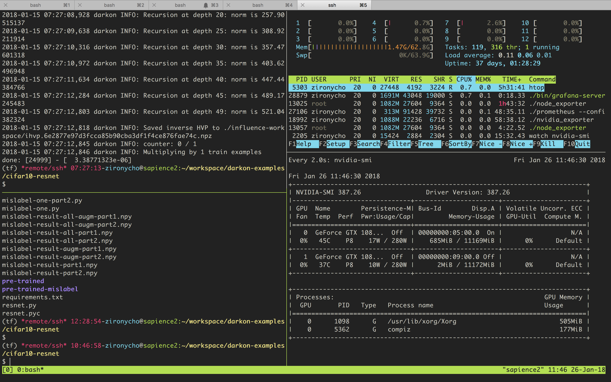
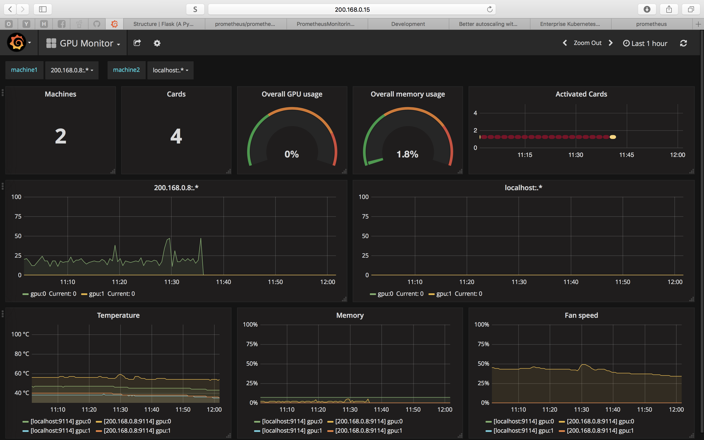
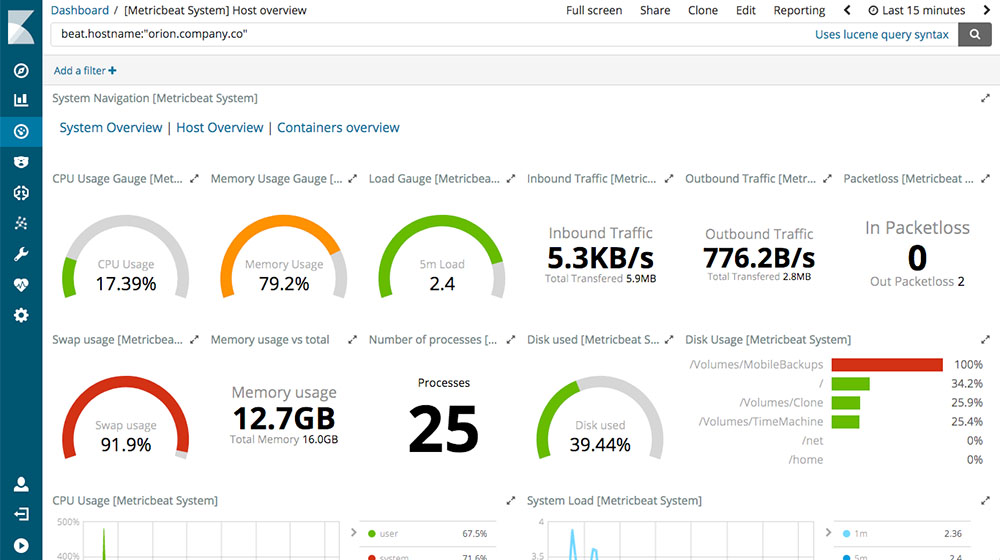
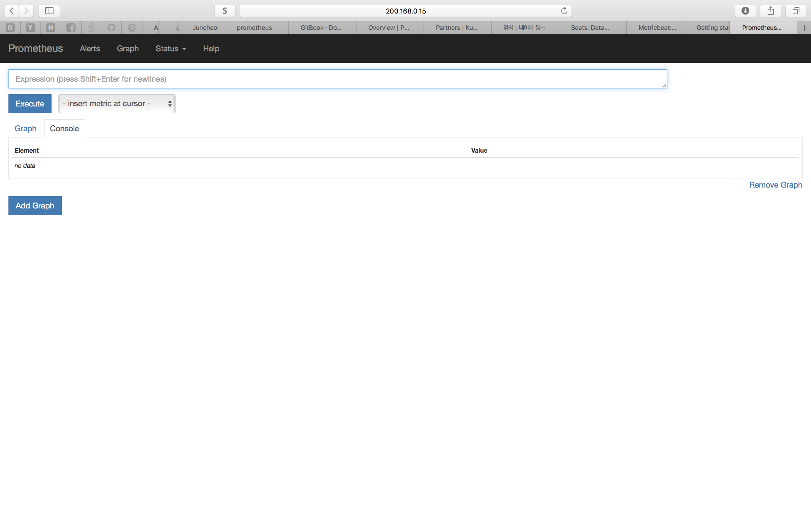
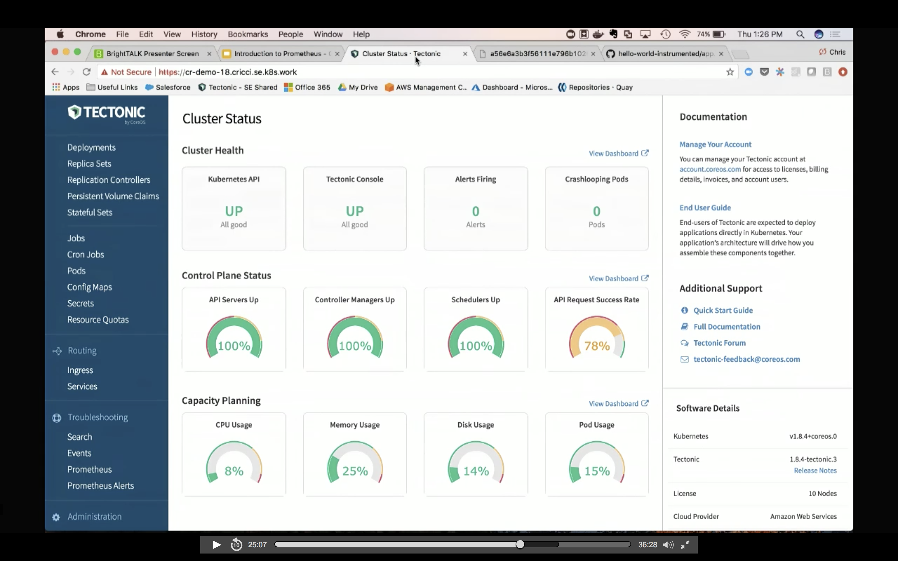

[Home](/README.md)

# 프로메티우스 (prometheus.io)
By [zironycho](http://github.com/zironycho) :heart: [Neosapience, Inc](http://www.neosapience.com)

## 목차
* 배경
* 사용에 앞서서
* 프로메티우스는
* 강약
* 어떻게
* 비쥬얼라이제이션 (By Grafana)
* 이후계획

<br><br><br><br><br><br><br><br><br><br><br><br>

## 배경
* ML관련 GPU잡들을 하나의 머신에서 날리고 있었음. 
* 모니터링이 그다지 필요 없어서, 처음에는 한 번씩 `nvidia-smi`를 이용해 현재 상태만 확인했었음.
* 그러다가 어떤 특정한 잡에서 메모리 이슈가 나면서, 모니터링을 해보고 싶었음.
* 일단은 현재 상황을 눈으로 보고 싶었기 때문에, 아래와 같은 형식으로 `tmux`를 이용해서 pane을 쪼개서 사용하면서 **실시간 모니터링**으로 만족함.


<br><br><br><br><br><br><br><br><br><br><br><br>

* 그러다가 gpu machine이 두 대가 되었고, 한 번에 보고 싶은 욕구가 생김.
* 그리고 실시간이 아닌 **시간축**으로 데이터를 보고 싶었음.
* **예쁘게** 보고 싶었음.
* 결국 아래와 같은 형태로 만듦

<br><br><br><br><br><br><br><br><br><br><br><br>


<br><br><br><br><br><br><br><br><br><br><br><br>
## 사용에 앞서서
* `Elasticsearch`의 `metricbeat`와 `prometheus` 둘 중 하나를 선택해야 했음
* 두 dashboard를 보고, 둘 중에 하나를 고르는 것은 쉬운 문제였음.
* `Grafana`를 사용하면 **예쁘게** 볼 수 있다고 알고 있었지만, 패키지 하나 더 설치하는 것은 귀찮았음.

<div>
  <table>
    <thead>
      <tr>
        <th>elasticsearch metricbeat</th>
        <th>prometheus</th>
      </tr>
    </thead>
    <tbody>
      <tr>
        <td width="50%">
          
        </td>
        <td width="50%">
          
        </td>
      </tr>
    </tbody>
  </table>
</div>

* 그래서 처음에는 `elasticsearch`의 `metricbeat`를 사용.
* 그런데 설치부터 헬이었음...
* `metricbeat`를 사용하기 위해서는 `Elasticsearc`, `Kibana`, `Metricbeat` 모두 설치해야 했음.
* 하지만 이미 시작한거, 끝까지 하기로 마음먹음
* 설치끝에 기본화면은 위 그림처럼 잘나옴.
* 그래서 GPU 데이터를 모아보기 위해 [community beats](https://www.elastic.co/guide/en/beats/libbeat/current/community-beats.html)를 찾았고 `nvidiagpubeat`를 손쉽게 접하게 됨.
* 써봤는데, 잘안됨. 10개월전에 작업하던 패키지임. 그사이 elastic은 빠른 속도로 변하고 있었음.. 엄청 변함..
* (이전에 찾았을 때는, 카카오브레인에서 올려둔 도커버젼용이 있었던거 같은데 못찾겠음. 스타해둘걸...)
* 그렇다고 이전 버젼의 패키지를 설치하고 싶지는 않았음.
* 결국 `prometheus`로 결정.

<br><br><br><br><br><br><br><br><br><br><br><br>
## 프로메티우스는
* By [SoundCloud](https://soundcloud.com/)
* Soundcloud에 입사한 ex-googler가 Google's Borgmon을 본 따서 시작됨.
* 모니터링 & 알림 시스템
* 타임시리즈 데이터 콜렉션 & 쿼리(PromQL)
* pull based over http
* push gateway를 이용해서 push 방식의 metric을 모을 수도 있음
* multi-dimensional data model
* 사용자가 exporter들을 만들어서 metric을 프로메티우스에게 제공할 수 있음
* 데이터 비쥬얼라이제이션은 `Grafana` 사용하면 좋음


<br><br><br><br><br><br><br><br><br><br><br><br>
## 강약
* 강
  * numeric time series(count, gauge)
  * 전반적인 분산 시스템 관리
* 약
  * 정확한 데이터 측정용으로는 비추
  * time range를 어떻게 하느냐에 따라서 비쥬얼라이제이션도 오락가락.. (example: ping)

<br><br><br><br><br><br><br><br><br><br><br><br>
## 어떻게
* [여기](https://prometheus.io/download/#prometheus)서 다운받아서 tar 압축풀어서 데몬으로 수행하면 됨.
```bash
$ tar xvfz prometheus-*.tar.gz
$ cd prometheus-*
$ ./prometheus --config.file=prometheus.yml
```

* `prometheus.yml` 이라는 config 파일을 수정하면 서버수행은 끝.

```yaml
# v2.0
# my global config
global:
  scrape_interval:     15s # Set the scrape interval to every 15 seconds. Default is every 1 minute.
  evaluation_interval: 15s # Evaluate rules every 15 seconds. The default is every 1 minute.
  # scrape_timeout is set to the global default (10s).

# Alertmanager configuration
alerting:
  alertmanagers:
  - static_configs:
    - targets:
      # - alertmanager:9093

# Load rules once and periodically evaluate them according to the global 'evaluation_interval'.
rule_files:
  # - "first_rules.yml"
  # - "second_rules.yml"

# A scrape configuration containing exactly one endpoint to scrape:
# Here it's Prometheus itself.
scrape_configs:
  # The job name is added as a label `job=<job_name>` to any timeseries scraped from this config.
  - job_name: 'prometheus'

    # metrics_path defaults to '/metrics'
    # scheme defaults to 'http'.

    static_configs:
      - targets: ['localhost:9090']

  - job_name: 'node'
    static_configs:
      - targets: ['localhost:9100']

  - job_name: 'node-gpu'
    static_configs:
      - targets: ['localhost:9114', '200.168.0.8:9114']

  - job_name: 'ping'
    static_configs:
      - targets: ['200.168.0.8:9123']
```

* 추가적인 exporter를 실행해줘야 원하는 metric을 뽑을 수 있음
  * [node_exporter](https://prometheus.io/download/#node_exporter)
  * [gpu_exporter](https://github.com/tankbusta/nvidia_exporter)
  * [ping_exporter](https://github.com/Oxalide/ping_exporter)

* [more exporters managed by prometheus](https://prometheus.io/download/)
  * alertmanager
  * blackbox_exporter
  * consul_exporter
  * graphite_exporter
  * haproxy_exporter
  * memcached_exporter
  * mysqld_exporter
  * node_exporter
  * pushgateway
  * statsd_exporter

* [more exporters](https://prometheus.io/docs/instrumenting/exporters/)


<br><br><br><br><br><br><br><br><br><br><br><br>
## 비쥬얼라이제이션 (By Grafana)
* 데이터 소스에 prometheus url 입력하면 끝인듯 
* 데이터 소스에 맞는 query를 보낼 수 있음.
* 쿼리 자동완성 지원.
* `grafana`에 들어가보면 [dashboard template](https://grafana.com/dashboards)들을 제공
* visualization panels
  * Singlestat
  * Graph
  * Table
  * Text
  * Heatmap
  * [more custom panel](https://grafana.com/plugins?type=panel)

<br><br><br><br><br><br><br><br><br><br><br><br>
## 이후계획
* aws 배포환경에서 사용해보기
* 알람 이용하기
* grafana template으로 찍어내기
* [Tectonic](https://coreos.com/tectonic/) 위에서 사용해보기



<br><br><br><br><br><br><br><br><br><br><br><br>
## 참고
* https://prometheus.io/docs
* https://www.elastic.co
* https://grafana.com
* https://www.brighttalk.com/webcast/14601/293915?utm_source=twitter&utm_medium=social&utm_campaign=organic