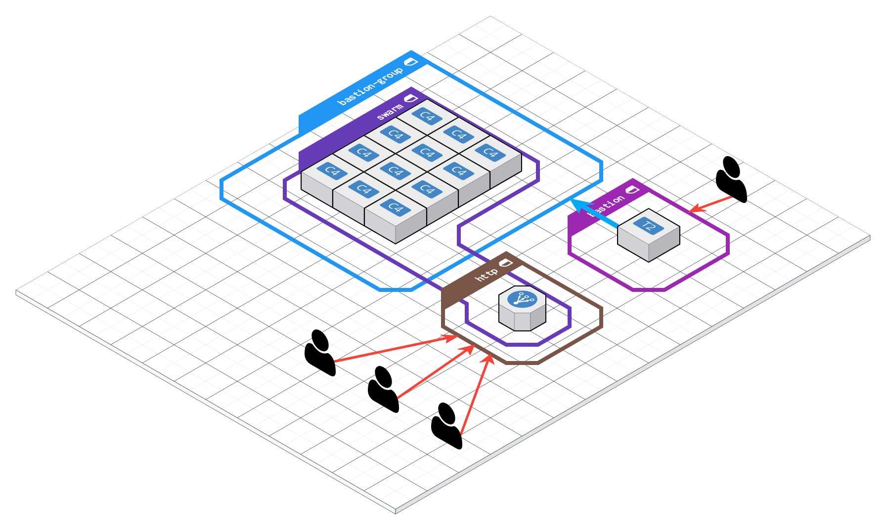
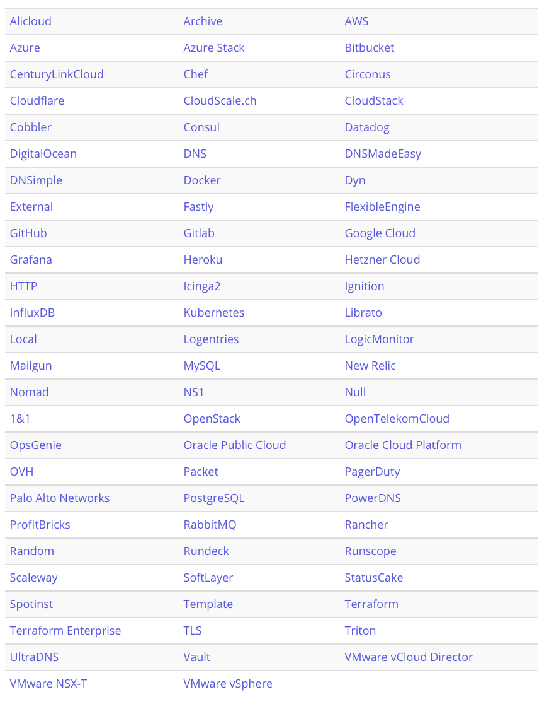

[Home](/README.md)

# Terraform for `swarm` in AWS
By [zironycho](http://github.com/zironycho) :heart: [Neosapience, Inc](http://www.neosapience.com), and OSEU
**2018.06.28**

<br><br><br><br><br><br>
---
### 목표
* Swarm cluster를 terraform을 이용해서 AWS에 배포

### 할것
* bastion host for SSH connection
* swarm cluster
  * master manager
  * managers
  * workers
* ALB(application load balancer)
* security groups
* deploy monitoring apps



<br><br><br><br><br><br>
---
## Terraform

### Terraform keywords 
* by `HashiCrop`
* golang
* `IaC`: Infrastructure as Code
* 풍부한 Providers


---
### ec2 인스턴스 생성하는 간단한 명령어

download terraform
```bash
brew install terraform
```

aws configure 을 이미 했다고 가정 (credential setting)
```bash
$ mkdir aws-swarm
$ cd aws-swarm

$ echo '
provider "aws" {
  region = "ap-southeast-1"
}

resource "aws_instance" "example" {
  ami           = "ami-3cded940"
  instance_type = "t2.nano"
}
' > main.tf

$ terraform init
# initialize privider plugins

$ terraform apply
yes
# create, delete, and update instances

$ terraform destroy
# delete all of resources
```

### ec2 인스턴스 100개 생성
```tf
resource "aws_instance" "example" {
  count = 100
  ...
}
```

<br><br><br><br><br><br>
---
## bastion host for ssh connection

### ec2, eip
```tf
resource "aws_instance" "bastion" {
  ami             = "${var.amis["bastion"]}"
  instance_type   = "t2.nano"
  security_groups = [
    "${aws_security_group.bastion.name}",
  ]
  key_name        = "${aws_key_pair.generated_key.key_name}"

  tags {
    Name = "swarm by tf" 
  }
}

resource "aws_eip" "bastion" {
  instance = "${aws_instance.bastion.id}"
  vpc = true
}

```

### private key
```
resource "tls_private_key" "tf-key" {
  algorithm = "RSA"
  rsa_bits  = 4096
}

resource "aws_key_pair" "generated_key" {
  key_name      = "tf-key"
  public_key    = "${tls_private_key.tf-key.public_key_openssh}"
}
```

### bastion security groups
```tf
resource "aws_security_group" "bastion" {
  name = "bastion"
  description = "Allow SSH traffic from the internet"
  vpc_id = "${var.vpc_id}"

  ingress {
    from_port       = 22
    to_port         = 22
    protocol        = "tcp"
    cidr_blocks     = ["0.0.0.0/0"]
    ipv6_cidr_blocks= ["::/0"]
  }

  egress {
    from_port       = 0
    to_port         = 0
    protocol        = -1
    cidr_blocks     = ["0.0.0.0/0"]
    ipv6_cidr_blocks= ["::/0"]
  }

  tags { Name = "swarm by tf" }
}

resource "aws_security_group" "bastion_group" {
  name = "bastion_group"
  description = "Grants access to SSH from bastion server"
  vpc_id = "${var.vpc_id}"

  ingress {
    from_port       = 22
    to_port         = 22
    protocol        = "tcp"
    security_groups = ["${aws_security_group.bastion.id}"]
  }
}

```

<br><br><br><br><br><br>
---
## swarm cluster

### master node
```tf
resource "aws_instance" "swarm_master" {
  ami           = "${lookup(var.amis, var.region)}"
  instance_type = "${var.instance_types["manager"]}"
  key_name      = "${aws_key_pair.generated_key.key_name}"

  security_groups = [
    "${aws_security_group.bastion_group.name}",
    "${aws_security_group.swarm.name}",
  ]

  tags { 
    Name = "swarm by tf - master" 
  }

  user_data     = <<-EOF
    #!/bin/bash
    docker swarm init
    docker swarm join-token worker --quiet > /worker.txt
    docker swarm join-token manager --quiet > /manager.txt
    EOF
}
```

### manager node
```tf
resource "aws_instance" "swarm_manager" {
  count         = "${var.num_managers}"
  ami           = "${lookup(var.amis, var.region)}"
  instance_type = "${var.instance_types["manager"]}"
  depends_on    = ["aws_instance.swarm_master"]
  key_name      = "${aws_key_pair.generated_key.key_name}"

  security_groups = [
    "${aws_security_group.bastion_group.name}",
    "${aws_security_group.swarm.name}",
  ]

  tags { 
    Name = "swarm by tf - manager" 
  }

  connection {
    type        = "ssh"
    host        = "${self.private_ip}"
    user        = "${var.username}"
    private_key = "${tls_private_key.tf-key.private_key_pem}"

    bastion_host        = "${aws_eip.bastion.public_ip}"
    bastion_user        = "${var.username}"
    bastion_private_key = "${tls_private_key.tf-key.private_key_pem}"
  }

  provisioner "file" {
    content     = "${tls_private_key.tf-key.private_key_pem}"
    destination = "~/key.pem"
  }

  provisioner "remote-exec" {
    inline = [
      "chmod 400 ~/key.pem",
      "ssh-keyscan ${aws_instance.swarm_master.private_ip} >> ~/.ssh/known_hosts",
      "scp -i ~/key.pem ${var.username}@${aws_instance.swarm_master.private_ip}:/manager.txt ./",
      "docker swarm join --token $$(cat manager.txt) ${aws_instance.swarm_master.private_ip}:2377"
    ]
  }
}
```

### worker node
based on `manager node`

```tf
resource "aws_instance" "swarm_worker" {
...

  count         = "${var.num_workers}"
  instance_type = "${var.instance_types["worker"]}"

...
  provisioner "remote-exec" {
    inline = [
      ...
      "scp -i ~/key.pem ${var.username}@${aws_instance.swarm_master.private_ip}:/worker.txt ./",
      "docker swarm join --token $$(cat worker.txt)
    ]
  }
}
```

### swarm security group

```tf
resource "aws_security_group" "swarm" {
  name        = "swarm"
  description = "tf swarm"
  vpc_id            = "${var.vpc_id}"

  ingress {
    from_port       = 0
    to_port         = 0
    protocol        = -1
    self            = true
  }

  egress {
    from_port       = 0
    to_port         = 0
    protocol        = -1
    cidr_blocks     = ["0.0.0.0/0"]
    ipv6_cidr_blocks= ["::/0"]
  }

  tags { Name = "swarm by tf" }
}

```

<br><br><br><br><br><br>
---
## Load balancers

### HTTP security group
```tf
resource "aws_security_group" "http" {
  name              = "http"
  description       = "tf elb open ports"
  vpc_id            = "${var.vpc_id}"

  ingress {
    from_port       = 80
    to_port         = 80
    protocol        = "tcp"
    cidr_blocks     = ["0.0.0.0/0"]
    ipv6_cidr_blocks= ["::/0"]
  }

  ingress {
    from_port       = 443
    to_port         = 443
    protocol        = "tcp"
    cidr_blocks     = ["0.0.0.0/0"]
    ipv6_cidr_blocks= ["::/0"]
  }

  egress {
    from_port       = 0
    to_port         = 0
    protocol        = -1
    cidr_blocks     = ["0.0.0.0/0"]
    ipv6_cidr_blocks= ["::/0"]
  }

  tags { Name = "swarm by tf" }
}

```

### frontend ALB
```tf
resource "aws_lb" "frontend" {
  name               = "frontend"
  internal           = false
  load_balancer_type = "application"
  security_groups    = [
    "${aws_security_group.swarm.id}",
    "${aws_security_group.http.id}",
  ]
  subnets            = ["${data.aws_subnet_ids.already_exists.ids}"]

  enable_deletion_protection = false

  tags {
    Name = "swarm by tf"
    Environment = "production"
  }
}

resource "aws_lb_listener" "frontend" {
  load_balancer_arn = "${aws_lb.frontend.arn}"
  port              = "80"
  protocol          = "HTTP"

  default_action {
    target_group_arn = "${aws_lb_target_group.frontend.arn}"
    type             = "forward"
  }
}

```


### frontend ALB Target group
```tf
resource "aws_lb_target_group" "frontend" {
  name     = "frontend"
  port     = 8080
  protocol = "HTTP"
  vpc_id   = "${var.vpc_id}"
}

resource "aws_lb_target_group_attachment" "master" {
  target_group_arn = "${aws_lb_target_group.frontend.arn}"
  target_id        = "${aws_instance.swarm_master.id}"
}

resource "aws_lb_target_group_attachment" "manager" {
  count = "${var.num_managers}"
  target_group_arn = "${aws_lb_target_group.frontend.arn}"
  target_id        = "${element(aws_instance.swarm_manager.*.id, count.index)}"
}

resource "aws_lb_target_group_attachment" "worker" {
  count = "${var.num_workers}"
  target_group_arn = "${aws_lb_target_group.frontend.arn}"
  target_id        = "${element(aws_instance.swarm_worker.*.id, count.index)}"
}

```

### Traefik dashboard ALB
```tf

resource "aws_lb" "traefik_dashboard" {
  name               = "traefik-dashboard"
  internal           = false
  load_balancer_type = "application"
  security_groups    = [
    "${aws_security_group.swarm.id}",
    "${aws_security_group.http.id}",
  ]
  subnets            = ["${data.aws_subnet_ids.already_exists.ids}"]

  enable_deletion_protection = false

  tags {
    Name = "swarm by tf"
    Environment = "production"
  }
}

resource "aws_lb_listener" "treafik_dashboard" {
  load_balancer_arn = "${aws_lb.traefik_dashboard.arn}"
  port              = "80"
  protocol          = "HTTP"

  default_action {
    target_group_arn = "${aws_lb_target_group.traefik_dashboard.arn}"
    type             = "forward"
  }
}
```

### Traefik dashboard ALB Target group
```tf
resource "aws_lb_target_group" "traefik_dashboard" {
  name     = "traefik-dashboard"
  port     = 8081
  protocol = "HTTP"
  vpc_id   = "${var.vpc_id}"
}

resource "aws_lb_target_group_attachment" "traefik_dashboard" {
  target_group_arn = "${aws_lb_target_group.traefik_dashboard.arn}"
  target_id        = "${aws_instance.swarm_master.id}"
}

```

<br><br><br><br><br><br>
---
## Etc

### data
```tf
data "aws_subnet_ids" "already_exists" {
  vpc_id = "${var.vpc_id}"
}
```

### variables
```tf
variable "region" { type = "string" }
variable "amis" { type = "map" }
variable "instance_types" { type = "map" }
variable "username" { type = "string" }

variable "num_managers" {}
variable "num_workers" {}

variable "vpc_id" { type = "string" }
```

### terraform.tfvars
```tf
region = "ap-southeast-1"

amis = {
  "ap-southeast-1" = "ami-3cded940"
  "us-west-2" = "ami-662f6d1e"
  "bastion" = "ami-3cded940"
}

instance_types = {
  "manager" = "t2.micro"
  "worker" = "t2.micro"
}

username = "core"

num_managers = 2
num_workers = 4

vpc_id = "vpc-xxxxxxxx"
```

### outputs
```
output "private_key" {
  value = "${tls_private_key.tf-key.private_key_pem}"
}
output "master" {
  value = "${aws_instance.swarm_master.public_ip}"
}
output "master_ip" {
  value = "${aws_instance.swarm_master.private_ip}"
}
output "elb_address" {
  value = [
    "${aws_lb.frontend.dns_name}",
    "${aws_lb.traefik_dashboard.dns_name}",
  ]
}
output "nodes" {
  value = [
    "${aws_instance.swarm_master.private_ip}",
    "${aws_instance.swarm_manager.*.private_ip}",
    "${aws_instance.swarm_worker.*.private_ip}",
  ]
}
output "bastion" {
  value = "${aws_eip.bastion.public_ip}"
}

```

### Makefile for accessibility
```Makefile

key:
	@rm -f key.pem
	@terraform output private_key > key.pem
	@chmod 400 key.pem

ssh:
	@ssh -i key.pem -Ao ProxyCommand="ssh -i key.pem -W %h:%p core@$(shell terraform output bastion)" core@$(shell terraform output master_ip)

addr:
	@terraform output elb_address

nodes:
	@terraform output nodes

bastion:
	@ssh -i key.pem core@$(shell terraform output bastion)

ssh-node:
	@ssh -i key.pem -Ao ProxyCommand="ssh -i key.pem -W %h:%p core@$(shell terraform output bastion)"  core@${addr}

```

<br><br><br><br><br><br>
---
## Monitoring services

### setup
```
local$ make key
local$ make ssh

ec2$ export HOST=tf-alb-474089815.ap-southeast-1.elb.amazonaws.com
ec2$ docker network create -d overlay backend
```

### reverse proxy: [Traefik](https://traefik.io/)
```tf
docker service create -d --name traefik \
  --constraint=node.role==manager \
  -p 8080:80 -p 8081:8080 \
  --mount type=bind,source=/var/run/docker.sock,target=/var/run/docker.sock \
  --network backend \
  traefik \
  --docker \
  --docker.swarmmode \
  --docker.domain=$HOST \
  --docker.watch \
  --api
```

### container visualization: [viz](https://github.com/dockersamples/docker-swarm-visualizer)
```
docker service create -d --name viz \
  --constraint=node.role==manager \
  --label "traefik.backend=viz" \
  --label "traefik.port=8080" \
  --label "traefik.frontend.rule=Host:$HOST;PathPrefixStrip:/viz" \
  --network backend \
  --mount=type=bind,src=/var/run/docker.sock,dst=/var/run/docker.sock \
  dockersamples/visualizer
```

### Management with GUI: [Portainer](https://portainer.io)
```
docker service create -d --name portainer \
  --constraint 'node.role == manager' \
  --label "traefik.backend=portainer" \
  --label "traefik.port=9000" \
  --label "traefik.frontend.rule=Host:$HOST;PathPrefixStrip:/portainer" \
  --network backend \
  --mount=type=bind,src=/var/run/docker.sock,dst=/var/run/docker.sock \
  portainer/portainer
```

### service monitoring: [prometheus - grafana](https://github.com/stefanprodan/swarmprom)
```
git clone https://github.com/zironycho/swarmprom.git
cd swarmprom
docker stack deploy -c docker-compose-traefik.yml mon
```

<br><br><br><br><br><br>

## test - container id app
```
### whoami
docker service create -d --name whoami \
  --label "traefik.backend=whoami" \
  --label "traefik.port=4567" \
  --label "traefik.frontend.rule=Host:$HOST;PathPrefixStrip:/whoami" \
  --network backend \
  --replicas 50 \
  subicura/whoami
```

<br><br><br><br><br><br>
---
## Next
* AWS VPC / AZ
* AWS ASG(Auto scaling group)
* terraform module
* multitple swarm cluster


<br><br><br><br><br><br>
---
## References
* https://www.terraform.io
* https://cloudcraft.co

