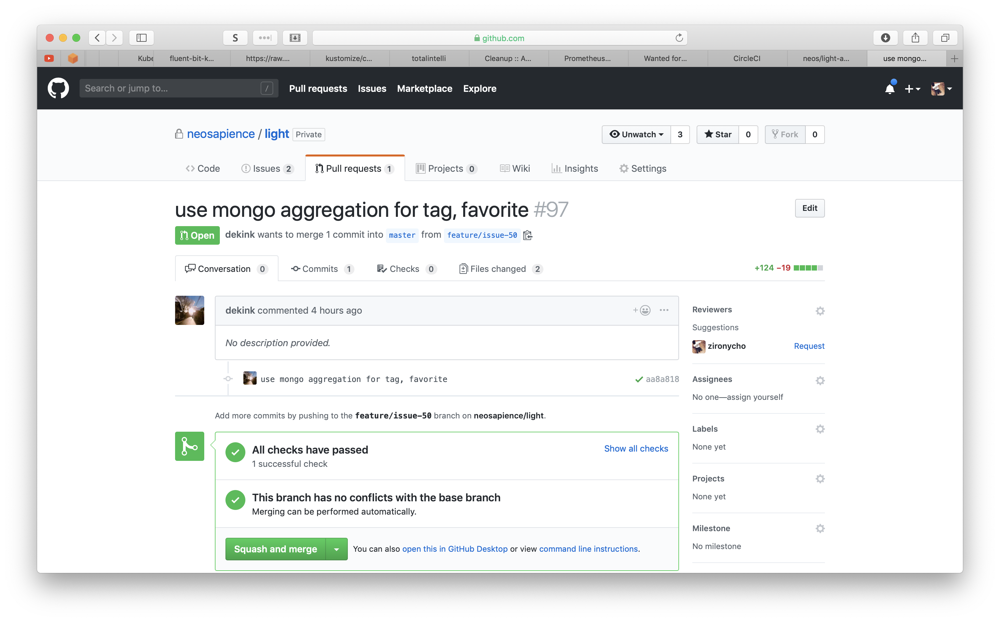
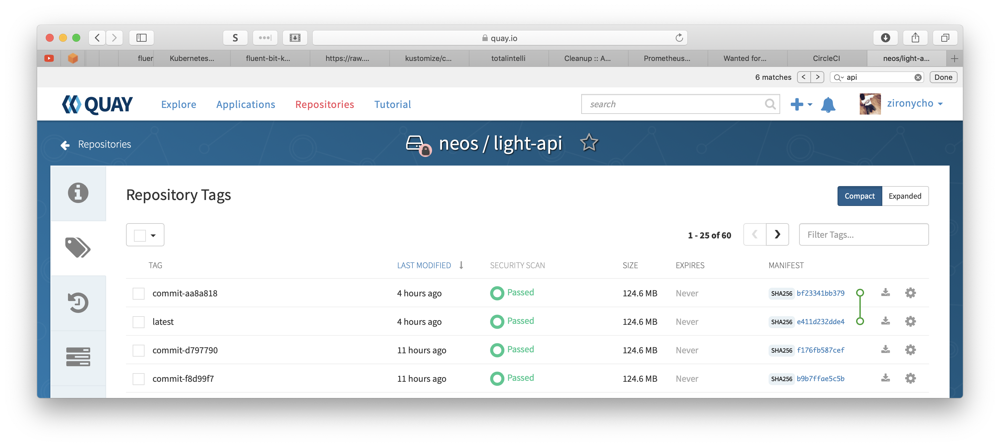
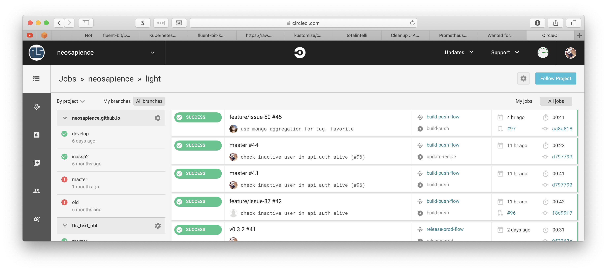
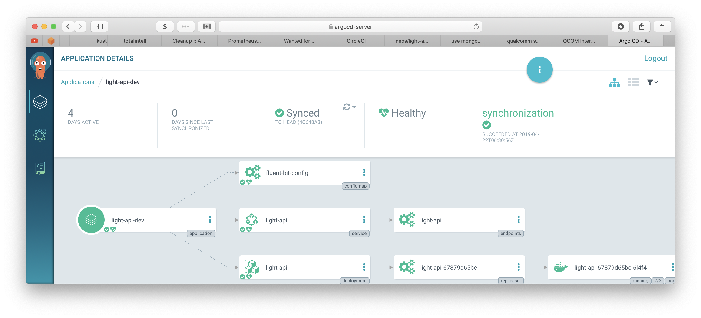

# Neosapience CI/CD and GitOps


## CI (Continuous Integration)

개발자는 코드를 배포하게 되면, 최종 배포 전 결과물까지 자동으로 만들어 주는 작업

지속적으로 코드를 통합하기 위해서는 아래의 작업들이 필요

* Git으로 코드를 관리
  * PR(pull request) based
  * pr이 뜨면
  
  
  
* 테스팅
  * 현재는 테스트는 로컬에서 하고 있음, 각자의 개발피씨에서 할 수 있음.
  * 독립적인 unittest를 만들어야 하는데, 현재는 integration test처럼 테스트코드가 작성되어 있음
  *  Next:
    * unittest가능하게 test case작성
    * mock 인터페이스, 데이터 만들기
  
* 이미지 빌드
  * docker로 독립적인 이미지 빌드 (Dockerfile)
  
  * 빌드시간 최소화를 위해 base image를 따로 만듬
    
    * CircleCI의 경우 DLC(docker layer cache)기능이 있음. 
      * 돈들이면 됨
    
  * registry는 [Quay.io](https://quay.io/repository/neos/light-api?tab=tags)
  
    
  
* [CircleCI](https://circleci.com/gh/neosapience/light)를 사용중임 (.circleci/config.yml)

  * 
  * 브랜치, 태그 별로 다른 workflow를 갖음 - 코드설명
  * 왜 CircleCI?:
    * Quay.io에도 docker image를 자동으로 빌드 할 수 있는 게 있으나, 빌드만 할뿐.. 더이상 아무것도 할 수 있는게 없었음...
    * 다른 방법은 Jenkins Pipeline을 k8s(kubernetes)에서 돌려서 CI를 대충구축
      * k8s가 여러개로 될 경우 deploy자동화를 구축하기 힘들어 보였음.
      * 무엇보다도 초기 셋업및 instance autoscale까지 고려하기 귀찮음(안그러면 돈들어가죠...)
      * ci와 cd를 떼어넣고 싶었음...
    * AWS CodeBuild를 이용
      * 속도가 빨랐음
      * 그냥.. 친숙하지 않았음….
      * aws account를 내가 만들어줘야 다른사람도 접근이 가능.. 귀차늠..
      * dokcer image도 quay.io로 보낼수 있었으나 셋팅하기 생각보다 귀차늠
      * secret manager를 이요해서 id/pw저장해야하는데 돈내야함.. 
    * CircleCI
      * github.com/neosapience 에 팀으로 되어 있으면 바로 사용가능.
      * 일단 build하는 container가 하나면 무료.
      * 나중에 오픈소스를 하거나, aws가 아닌 환경에서도 친숙하게 사용가능


## CD(Continuous Delivery)

지속적으로 이미지를 배포, 다양한 툴이 제공됨

* 처음 클러스터: Swarm
  * `Jenkins Pipeline`으로 하려 했으나 quay.io에서 trigger받는것을 실패.
  * quay.io가 업데이트가 되면서 지원안됨… 

* 다음 클러스터: k8s(kubernetes)

  * 프로비저닝은 eksctl

  * `argocd` 가 핫해보였음..

    

  * Git의 latest code의 최근코드와 계속 sync하면서 관련된 파일들이 업데이트가 있을경우, 자동으로 배포함.

    * ```bash
      argocd app create light-api-dev \
        --repo https://github.com/neosapience/eks-recipe.git \
        --path k8s/apps/neos/dev/light/api \
        --dest-namespace neos-dev \
        --dest-server https://kubernetes.default.svc \
        --sync-policy automated \
        --auto-prune
      ```

  * 문제는 yaml 파일을 자동으로 업데이트 하는것.

    * 현재는 순서 k8s yaml파일임...
    
    * 그래서 yaml파일을 업데이트 하는 코드 만듬.
    
      ```python
      def update_config_value(cfg, key, value):
          steps = key.split('.')
          data = cfg
          for k in steps[:-1]:
              data = data[k]
          if steps[-1] not in data:
              raise RuntimeError(f'could not find key: {key}')
          data[steps[-1]] = value
      
      
      if __name__ == '__main__':
          parser = argparse.ArgumentParser(description='update deployment sha')
          parser.add_argument('--file', help='target yaml file', required=True)
          parser.add_argument('--key', help='key for update', required=True)
          parser.add_argument('--value', help='value for update', required=True)
          args = parser.parse_args()
      
          config = yaml.load(open(args.file))
          update_config_value(config, args.key, args.value)
      
          with open(args.file, 'w') as f:
              yaml.dump(config, f, default_flow_style=False)
      
      
      ```
    
    * 약간의 수정은 괜찮았으나, 더 깊이 수정하려면 array access까지 구현해야 해서 귀찮음.
    
    * 찾아보니 config전문적으로 하는 툴들이 있음 [kustomize.io](https://kustomize.io)에 꽂힘.
    
      * overlay구조가 맘에듬.
      * template구조는 생각보다 할게 많아 보였음..
    
    * Next
    
      * kustomize.io를 이용해서 config를 변경해 가는과정필요
      * production에도 적용
      * config를 현재는 master에 바로 업데이트 하는데, pull request로 업데이트 하도록


## GitOps


### 왜 GitOps를 선택, not CiOps

* config code에 의해서 deploy가 자동으로 된다면 git을 볼줄 아는 사람이라면 아무나 배포가능

  * 더불어 버젼관리도 됨
  * 특정버젼으로 rollback도 git으로 가능

* ci system이 외부에 있을경우, secury이슈

* ci system이 내부에 있을경우

  * 다른 cluster에 대한 security 이슈
  * 이미지에 대한 정책
  * cluster를 버릴경우, CI시스템 다시구축..

* cluster마다 서로다른 config가 존재할 경우

  


## Reference

* <https://www.weave.works/technologies/gitops/>
* https://medium.com/weaveworks/kubernetes-anti-patterns-lets-do-gitops-not-ciops-550ebed10cec

* <https://www.weave.works/blog/gitops-operations-by-pull-request>
* <https://www.weave.works/blog/what-is-gitops-really>