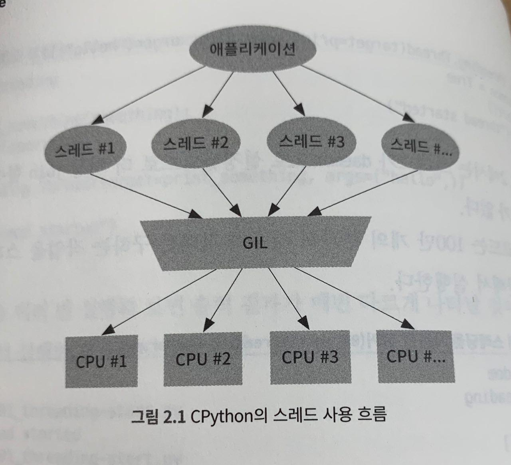
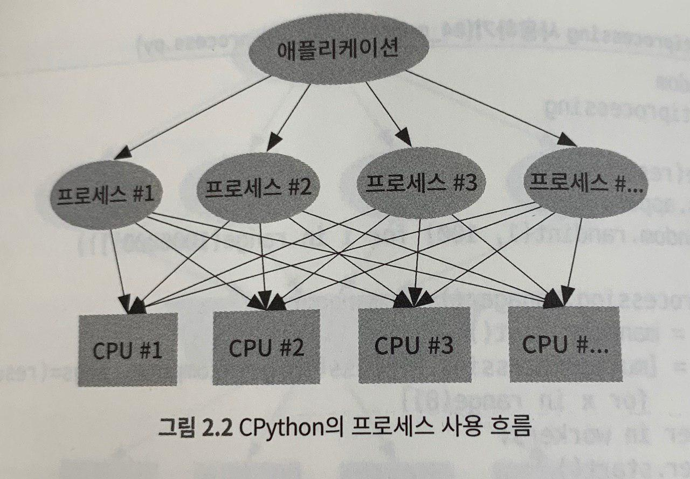
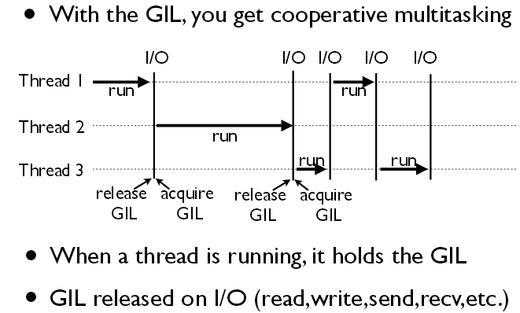

# 실전 스케일링 파이썬 프로그래밍 (책 스터디 #1)
> 파이콘에서 이 책을 받게되어서, 기본을 좀 다질겸... [책 링크](http://www.yes24.com/Product/Goods/63747074)


## 1. 확장

분산 시스템을 만드는 가장 좋은 방법은 공유 상태가 없는 완전한 순수 함수를 만드는 것.


## 2. cpu확장

CPU속도는 무한히 빨라지지 않으므로 CPU를 여러개를 사용하는 것이 확장성을 위한 최선의 방법이다.


 ### 4-core cpu 환경

* Multi-thread(8workers) - **137%** cpu

* Multi-process(8workers) - **380%** cpu


### 공유데이터

* 공유데이터에 대한 문제가 생김, 아래와 같이 shared list를 생성할 수 있음
* 되도록 공유데이터보다는 각각의 처리한 결과를 반환만 하는게 좋음.

```python
import multiprocessing as mp

with mp.Manager() as manager:
    shared_list = manager.list()
```


### pool 사용

* pool을 상용해서 worker를 재사용가능

```python
import multiprocessing as mp
pool = mp.Pool(processes=8)
pool.map(func, range(8))
```


### concurrent.futures

concurrent.futures.Future를 사용하면  `promise`  처럼 사용가능


### kotyledon package

* 장시간 실행되는 프로세스를 만들고 관리
* 프로세스가 죽거나 크래쉬 발생시 자동으로 프로세스를 만듬
* SIGHUB 받을시 `cotyledon.ServiceManager.reload()` 호출되면서 다시 config해서 워커를 늘리는 일도 가능


### thread vs process

* 처리량을(computation power)를 위해서는 **process**
* io를 위해서는 **thread**
  * io작업의 경우 cpu를 많이 사용하는게 아닌 대기가 많음.
* cpu를 많이 사용하는 작업이라면 C혹은 cython으로 작성된 라이브러리를 사용하여 GIL을 사용하지 않고 객체 변경가능
  * ex) numpy
* 여러 노드에서 여러개의 프로세스가 실행된다면 메세지 큐 기반의 pub/sub을 추천








## GIL function

[PyGILState_Ensure()](https://github.com/python/cpython/blob/c4cacc8c5eab50db8da3140353596f38a01115ca/Python/pystate.c#L1275)


## ECT

* GIL(global interpreter lock) 콜 시점
* [GIL](https://icecube.wisc.edu/~dschultz/docs/slides/software_bootcamp/gil.html#4_)
* SIGHUB
* [cython, pybind, cffi](http://blog.behnel.de/posts/cython-pybind11-cffi-which-tool-to-choose.html)

