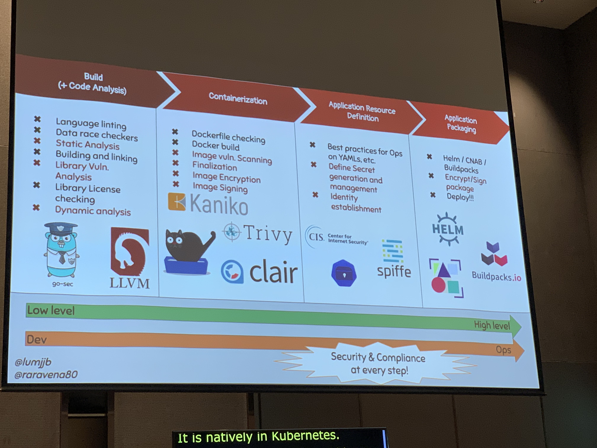
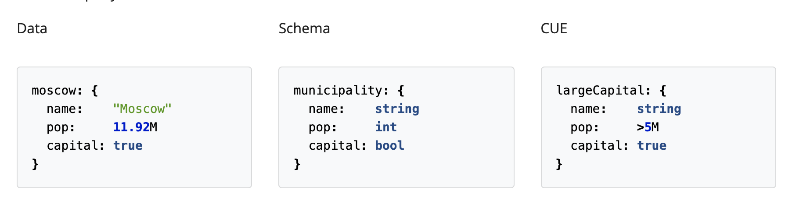
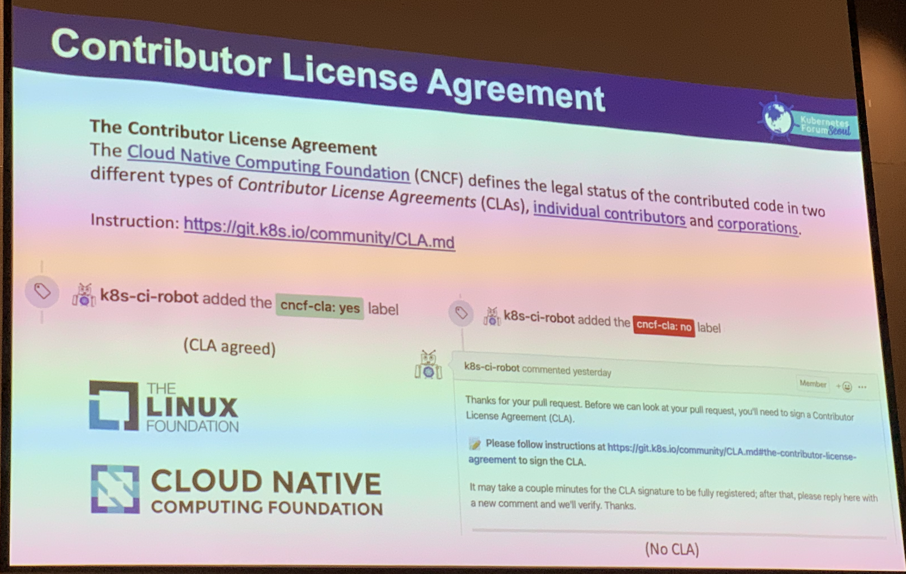
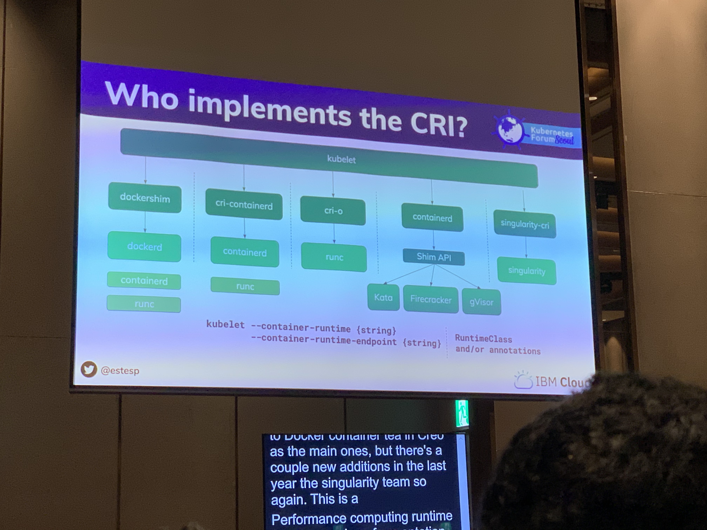

[Home](/README.md)

# kubernetes SEOUL


## kubeflow

  * 리서치 팀 필요할까요?
    * 모델링 관리
    * 파이프라이닝
    * 어떻게 쓰는지 써보고 괜찮은지 판단필요..

  * kfserving
    * focused infernecing in kubernetes
      * using CRD
      * auto scaling, network, health checking, scale to zero
      * https://github.com/kubeflow/kfserving


## GitOps, Security pipeline, 

* dockerfile lint
  * https://github.com/hadolint/hadolint
* vulnerability
  * code scanning
  * docker image scanning
    * [Clair - Redhat](https://github.com/arminc/clair-scanner)
    * [Trivy - Aquasec](https://github.com/aquasecurity/trivy)

* secret manager: spiffe/spire




* cofiguration languages:
  * [dhall](https://dhall-lang.org/) - programmerble configuration language
  * [cue](https://github.com/cuelang/cue) - data validation language
    * export: **go**code, protobuff
    * 


## monitoring: prometheus, open metrics

* [OpenMetrics](https://github.com/OpenObservability/OpenMetrics)
  * metrics에 표준화에 노력중.
    * rfc
    * Mimetype
    * IANA
  * cncf에 등록되있는 sandbox project
  * 메일링 리스트로 운영중
  * 프로메테우스는 벤더 종속느낌이라서? 프로메테우스라는 이름말고 스탠다드로 만드려는 노력
  * 전체적인 로그표현방식은 프로메테우스와 거의 유사
    * 유닛이 추가되고
    * 타임스템프 단위가 다르고


## k8s Operator

> 특정 서비스를 하나의 레시피로 올리고 관리하기 힘드니 Operator를 만들어서 자동으로 배포하고 k8s에서 동작하게 할 수 있는 컨셉. 몽고비디 오퍼레이터의 경우, 쉽게 replica 및 sharding, backup을 할 수 있고, Jaeger같은경우도 쉽게 배포및 동작이 가능. 서비스를 띄우기 위해 신경써야 하는 변수가 많이 줄어듬

* 각종 k8s 오퍼레이터 모음: https://operatorhub.io/
* custom operator framework - https://github.com/operator-framework/getting-started
* typecast operator??


## Break time

> 모니터링, APM회사들이 많음...

* Dynatrace: APM, monitoring
* Instana: APM, monitoring
* NexClipper: monitoring


## Multi cluster scaling

* **Federation v2**

  * 여러개의 k8s클러스터를 관리하는 컨트롤러?

  * 

  * [sample recipes](https://github.com/kubernetes-sigs/kubefed/blob/master/example/sample1)

    * ex) create name space for multiple cluster

    ```yaml
    apiVersion: types.kubefed.io/v1beta1
    kind: FederatedNamespace
    metadata:
      name: test-namespace
      namespace: test-namespace
    spec:
      placement:
        clusters:
        - name: cluster2
        - name: cluster1
    ```

    * ex) override deployment

    ```yaml
    apiVersion: types.kubefed.io/v1beta1
    kind: FederatedDeployment
    metadata:
      name: test-deployment
      namespace: test-namespace
    spec:
      template:
        metadata:
          labels:
            app: nginx
        spec:
          replicas: 3
          selector:
            matchLabels:
              app: nginx
          template:
            metadata:
              labels:
                app: nginx
            spec:
              containers:
              - image: nginx
                name: nginx
      placement:
        clusters:
        - name: cluster2
        - name: cluster1
      overrides:
      - clusterName: cluster2
        clusterOverrides:
        - path: "/spec/replicas"
          value: 5
        - path: "/spec/template/spec/containers/0/image"
          value: "nginx:1.17.0-alpine"
        - path: "/metadata/annotations"
          op: "add"
          value:
            foo: bar
        - path: "/metadata/annotations/foo"
          op: "remove"
    ```

    

* **cluster api**

  * k8s를 provisioning 할수 있는 CRD

  * [concept](https://cluster-api.sigs.k8s.io/user/concepts.html)

  * provider related

    * need manager:
      * Core (Cluster API)
      * Bootstrap (kubeadm)
      * Infrastructure (aws, gcp, azure, vsphere, etc)
    * controllers:
      * Cluster
      * Machine
      * MachineSet
      * MachineDeployment

  * [example cluster recipe](https://github.com/kubernetes-sigs/cluster-api/blob/ff678f6ccbadba9286461c31b161616f759262a0/test/infrastructure/docker/examples/simple-cluster.yaml)

    ```yaml
    apiVersion: cluster.x-k8s.io/v1alpha2
    kind: Cluster
    metadata:
      name: capi-quickstart
    spec:
      clusterNetwork:
        pods:
          cidrBlocks: ["192.168.0.0/16"]
      infrastructureRef:
        apiVersion: infrastructure.cluster.x-k8s.io/v1alpha2
        kind: AWSCluster
        name: capi-quickstart
    ---
    apiVersion: infrastructure.cluster.x-k8s.io/v1alpha2
    kind: AWSCluster
    metadata:
      name: capi-quickstart
    spec:
      region: us-east-1
      sshKeyName: default
    ```

    

## OPA(오빠...)

> 쿠버네티스에 deploy할때, 제약을 줄 수 있음. 예를들면 특정 registry 주소를 블락시킬수 있음. Admission controller

* https://kubernetes.io/blog/2019/08/06/opa-gatekeeper-policy-and-governance-for-kubernetes/
* https://www.openpolicyagent.org/

* Policy language: Rego

```java
package kubernetes.admission

deny[msg] {
    input.request.kind.kind == "Pod"
    some i
    image := input.request.object.spec.containers[i].image
    not startswith(image, "hooli.com/")
    msg := sprintf("image '%v' comes from untrusted registry", [image])
}
          
```

The `input` document contains the following fields:

- `input.request.kind` specifies the type of the object (e.g., `Pod`, `Service`, etc.)
- `input.request.operation` specifies the type of the operation, i.e., `CREATE`, `UPDATE`, `DELETE`, `CONNECT`.
- `input.request.userInfo` specifies the identity of the caller.
- `input.request.object` contains the entire Kubernetes object.
- `input.request.oldObject` specifies the previous version of the Kubernetes object on `UPDATE` and `DELETE`.


## k8s 한글화

* 문서화 웹사이트: [hugo](https://gohugo.io/)를 사용 

  * static site generator written in GO

* CNCF contiribution시 주의할점은.. 개인으로 하게 되면 상관없지만 회사에 속해 있는 사람은 계약내용을 잘봐야함.

  


## k8s security best practice:

* 되도록.. managed k8s service를 사용해라..
  * GKE같은..
* 혼자 올릴경우 클러스터 공격에 신경써야 할게 많다..


## OCI / CRI

OCI: open container initiative

CRI: container runtime interfaces

* cri-o

* rtk

* docker cri shim

  


## ref

* https://www.researchgate.net/figure/Example-of-the-Kubernetes-federation-architecture-The-federation-application-program_fig1_330255698

* https://medium.com/condenastengineering/clusterapi-a-guide-on-how-to-get-started-ff9a81262945