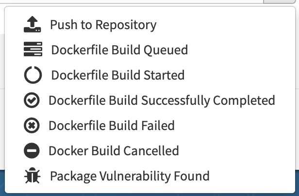

# Jenkins + quay.io in swarm for CD

친절한 설명이 아닌, 백업용자료입니다.


## scenario

push to github **>** `quay.io` build image **>** `Jenkins` deploy to swarm **>** slack notification


 시나리오는 위 처럼, 코드 푸쉬를 하게 되면, `quay.io`에서 webhook을 받아서 이미지를 빌드하고, 젠킨스에서 그 이미지를 swarm cluster에서 해당 업데이트 하는 것이다. 사실 jenkins에서 github에서 webhook 받아서 이미지 빌드하고 test돌리고, 이미지 푸쉬한 다음에 해당이미지로 stack/service를 업데이트 할 수 있지만, quay.io에서 이미지 빌드하는 기능이 있어서 저러한 방식으로 시도해 보았다.

 결론적으로는 quay.io를 통해서는 안되었다. jenkins 플러그인에 [quay.io trigger](https://wiki.jenkins.io/display/JENKINS/Quay.io+Trigger+Plugin) 라는게 있는데, 버그가 있어서 trigger가 안된다. 그리고 trigger를 할 수 있는 것도 quay.io가 보낼 수 있는 이벤트도 아래와 같이 7가지나 되지만, `push to repository` 만 처리할 수 있게 되어있다. 만약 master branch를 build하게 된다면 이벤트도 두개나 오게 된다(master, latest). 




실패하긴 했지만, 셋업했던 자료들을 공유해 본다.


## Setup Jenkins

### Install Jenkins in swarm cluster

* https://github.com/zironycho/jenkins-swarm

### Github authorization

* personal access token:
  * credentials > global > add credentials > username with password
  * https://ict-nroo.tistory.com/35
  * https://github.com/settings/tokens
* (options) oauth 연동:
  * https://jojoldu.tistory.com/310
  * 문제: agent들이 접속이 안됨..

### Slack notification

* Slack Plugin: https://wiki.jenkins.io/display/JENKINS/Slack+Plugin
  - configure slack token:
    - `manage jenkins` > `configure system` > **`Global Slack Notifier Settings`**

  - configure shared library for slack

     - `manage jenkins` > `configure system` > **`Global Pipeline Libraries`**
        - register: https://github.com/neosapience/jenkins-pipeline-shared

* Jenkinsfile

   ```groovy
   #!groovy
   @Library('pipeline-shared') _ 
   
   pipeline {
       ...
       post {
           success { sendNotifications 'SUCCESSFUL' }
           failure { sendNotifications 'FAILURE' }
       }
       ...
   ```

### Quay.io

* quay.io site) build: setup repositories > choose image > builds > `create build trigger`

* quay.io site) event: setup repositories > choose image > settings > `create notification`

* quay.io site) create bot account and assign repositories 

* jenkins) add bot auth:

  * credentials > global > add credentials > username with password

* jenkins file for quay.io credential

  ```groovy
  pipeline {
      ...
      stages {
          stage('deploy') {
              steps {
                  withCredentials([usernamePassword(
                      credentialsId: 'QUAY_AUTH', 
                      usernameVariable: 'username', 
                      passwordVariable: 'password'
                  )]) {
                      sh 'docker login quay.io -u $username -p $password'
                  }
              }
          }
      }
      ...
  }
  ```

### Conditional deployment

* jenkins에 hook되었을 때, master를 이용하는 것과, tag를 이용하는 것을 분리해서 deploy

```groovy
pipeline {
    ...
    stages {
        stage('deploy by master') {
            when {
                expression { return env.GIT_BRANCH == 'origin/master' }
            }
            steps {
                ...
            }
        }
        stage('deploy by tag') {
            when {
                expression { return env.GIT_BRANCH.startsWith('tags/') }
            }
            steps {
                ...
            }
        }
    }
    ...
}

```


### Debugging

* print env in Jenkinsfile
  * `echo sh(returnStdout: true, script: 'env')`

* jenkins pipeline script
  * groovy language


## More...

### docker host api 변경

- swarm deploy를 위해서 현재는 manager node에 띄웠음.
  - worker node에서 띄월수 있음.
  - swarm_host 변경


## Ref:

* credential binding: https://jenkins.io/doc/pipeline/steps/credentials-binding/
* stack deploy: http://blog.itp-inc.com/building-ci-cd-pipeline-with-jenkins-github-and-docker-swarm/

### conditional deployment

- https://jenkins.io/blog/2018/05/16/pipelines-with-git-tags/
- https://dingyuliang.me/jenkins-declarative-pipeline-use-conditional-stages/
- https://stackoverflow.com/questions/48363217/execute-jenkins-pipeline-step-only-when-building-a-tag
- trigger tag: https://mohamicorp.atlassian.net/wiki/spaces/DOC/pages/136740885/Triggering+Jenkins+Based+on+New+Tags
- expression examples: https://jenkins.io/blog/2017/01/19/converting-conditional-to-pipeline/