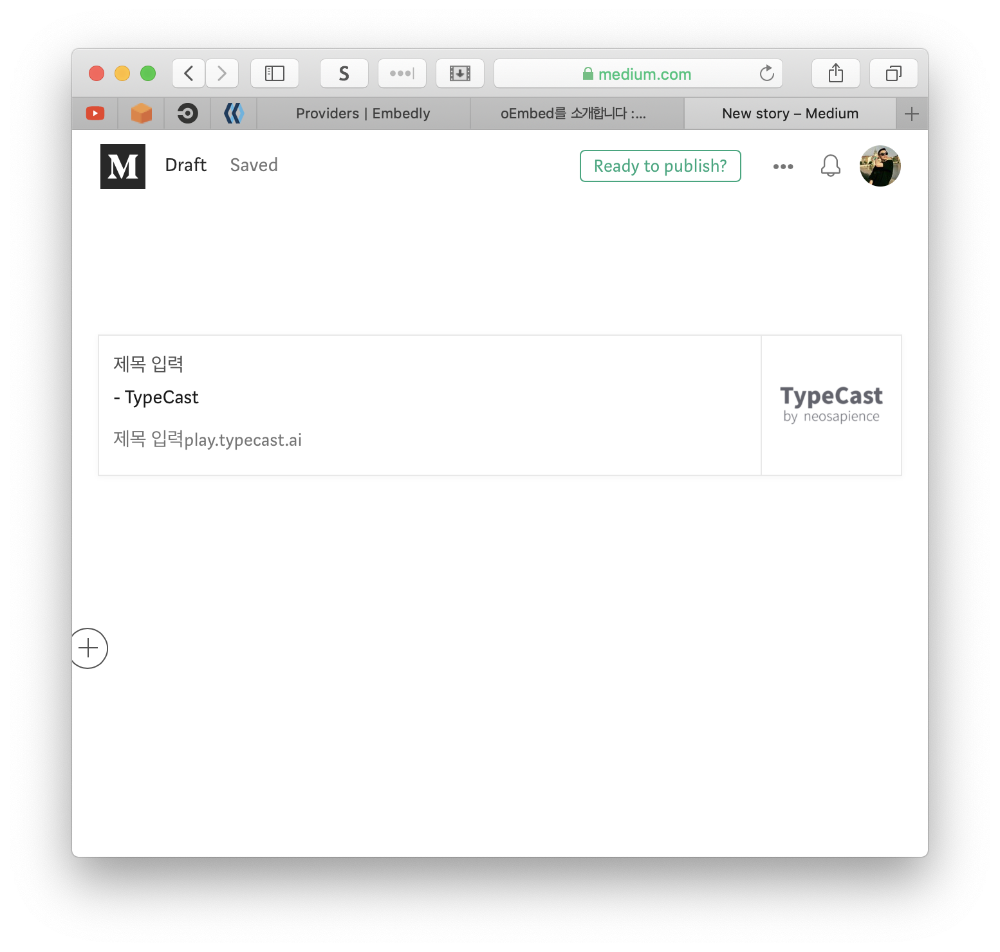
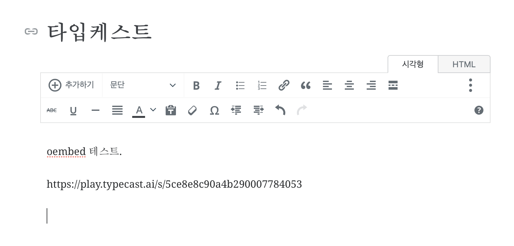
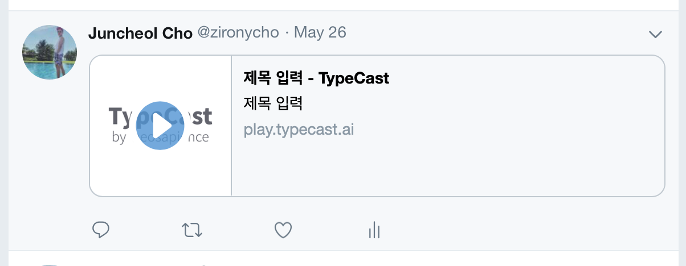
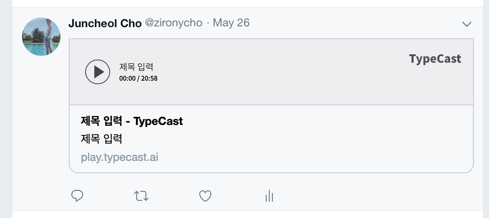

# share audio player: `iframe` and `oembed`

* iframe을 이용해서 블로그들에 붙이려고 했으나 지원되지 않는 블로그들이 많음.

  * wordpress에도 iframe을 넣으면 지워버림..

  

* iframe의 코드를 쉐어링하는것도 사실.. 비개발자에겐 편하지 않음. 이딴걸 어딘가 붙여 넣어야 한다는게.. 인식이 되겠음??

  ```html
  <iframe src="https://play.typecast.ai/e/5ce8e8c90a4b290007784053" width="100%" height="65px" frameborder="0" scrolling="no"></iframe>
  ```


* 그래서 oembed discovery용 링크를 provider가 html head에 제공함으로써 사용자는 url만을 사용해서 공유. 이 링크를 파싱해서 블로그사이트들이 사용하는듯

  ```
  https://play.typecast.ai/s/5ce8e8c90a4b290007784053
  ```


* oembed discovery spec

  ```html
  <link rel="alternate" type="text/json+oembed" href="https://play.typecast.ai/oembed?url=https%3A%2F%2Fplay.typecast.ai%2Fs%2F5ce8e8c90a4b290007784053&amp;format=json">
  
  <link rel="alternate" type="text/xml+oembed" href="https://play.typecast.ai/oembed?url=https%3A%2F%2Fplay.typecast.ai%2Fs%2F5ce8e8c90a4b290007784053&amp;format=xml">
  
  ```


* 하지만 모든 블로그사이트들이 내가 oembed를 지원한다고해서 이걸 사용해 주지는 않음. 기존에 oembed를 지원하는 애들이더라도 provider를 등록해줘야 사용할 수 있을 때도 있음...


### oembed request spec

```
url (required) - url encoded
format (optional) - json or xml
maxwidth (optional)
maxheight (optional)
```


### oembed response spec (example)

```json
{
  "type": "rich",
  "version": 1,
  "provider_name": "TypeCast",
  "provider_url": "https://typecast.ai",
  "thumbnail_url": "https://s3.ap-northeast-2.amazonaws.com/static.neosapience.com/img/typecast-logo.png",
  "thumbnail_width": 512,
  "thumbnail_height": 512,
  "html": "<iframe width=\"100%\" height=\"65\" scrolling=\"no\" frameborder=\"no\" src=\"https://play.typecast.ai/e/5ce8e8c90a4b290007784053\"></iframe>",
  "width": "100%",
  "height": "65",
}
```


### oembed provider를 등록

* https://oembed.com/
  
  * pr날리면 등록해줌.
  * 어디서 이 목록을 사용하는지는 알수가 없음...
  * 여기에 등록한다고 다 되는것도 아니고...
  
* medium
  
* https://embed.ly 에 등록된 프로바이더를 이용하는듯 보임
  
* wordpress
  * whitelist를 따로 등록안해도 동작은 함
  * 원하는 모습으로 안나옴…(뭘 잘못했나봄….)
  
* naver

  * oembed를 지원하는 것 같은데 whitelist가 있는건지, play.tyepcast.ai는 안됨.
  * youtube, soundcloud는 되더라..

  


## typecast.ai를 미디엄에 rich하게 제공하기

* 링크복사를 하면 미디엄에서 프로바이더를 보고 해석하는듯.
* 없으면 opengraph thumbnail및 title, descript으로 보여줌
  * 
* oembed provider등록시
  * 아래처럼.. 아직없네..


## wordpress에 넣어보기

[wordpress example link](https://zironycho.wordpress.com/2019/05/29/타입케스트/)




## Twitter에 audio player올리기

이녀석들은 또 특이함...

meta 태그를 이용해서 플레이어를 제공해 줄수 있음. 

메타 태그에 `twitter:player`를 달아주고, iframe용으로 사용할 주소와 width, height을 주게 되면 됨.

> `twitter:player`: HTTPS URL to iFrame player. This must be a HTTPS URL which does not generate active mixed content warnings in a web browser. The audio or video player must not require plugins such as Adobe Flash.


```html
<meta data-n-head="true" property="twitter:site" content="TypeCast">
<meta data-n-head="true" property="twitter:title" content="제목 입력 - TypeCast">
<meta data-n-head="true" property="twitter:description" content="제목 입력">
<meta data-n-head="true" property="twitter:image" content="https://s3.ap-northeast-2.amazonaws.com/static.neosapience.com/img/typecast-logo.png">


<meta data-n-head="true" property="twitter:card" content="player">
<meta data-n-head="true" property="twitter:player" content="https://play.typecast.ai/s/5ce8e8c90a4b290007784053">
<meta data-n-head="true" property="twitter:player:height" content="65">
<meta data-n-head="true" property="twitter:player:width" content="400">
```


[Twitter Example Link](https://twitter.com/zironycho/status/1132651431561900032)






## refs

https://meetup.toast.com/posts/81

https://developer.twitter.com/en/docs/tweets/optimize-with-cards/overview/player-card.html