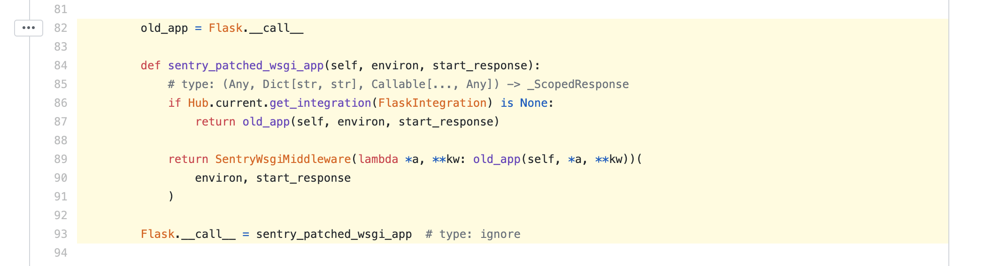

# sentry flask code

> 어떻게 sentry_sdk.init 하나만으로 flask app의 error message들을 보낼 수 있는지 깊게 들어가보자.

## flask init code

상당히 간단하다. 아래처럼 flask app을 생성 전에 sentry_sdk.init()을 해주면 된다. 그 이후 flask에서 에러가 발생하면 sentry서버로 message를 전송하게 된다.

```python
from flask import Flask
import sentry_sdk
from sentry_sdk.integrations.flask import FlaskIntegration

sentry_sdk.init(
    dsn="https://49359c2fca7741058e12c0ad6af35ef4@o354244.ingest.sentry.io/5174014",
    integrations=[FlaskIntegration()]
)

app = Flask(__name__)
```


### sentry_sdk.init -> flask integration

[_init이 불리게 된다](https://github.com/getsentry/sentry-python/blob/cd646579d04e2fad6a8994304314ac52fec2f83c/sentry_sdk/hub.py#L100)

[그 이후 Client()를 생성하게 되는데](https://github.com/getsentry/sentry-python/blob/cd646579d04e2fad6a8994304314ac52fec2f83c/sentry_sdk/client.py#L74)

[그러면 아래부분에서 integrations으로 오는 파라미터를 받아서 setup_integration()을 하게 된다.](https://github.com/getsentry/sentry-python/blob/cd646579d04e2fad6a8994304314ac52fec2f83c/sentry_sdk/client.py#L121)

[그 후, 모든 integration에 대해서 setup_once()라는 static method를 콜하게 된다](https://github.com/getsentry/sentry-python/blob/cd646579d04e2fad6a8994304314ac52fec2f83c/sentry_sdk/integrations/__init__.py#L120)


flask app 생성시 `app = Flask(__name__)` 이렇게 생성하게 되는데. 

[실제 플라스크쪽 코드를 보게 되면 `__call__` 이부분에 의해서 앱이 만들어 짐을 알수 있다.](https://github.com/pallets/flask/blob/2062d984abd3364557a6dcbd3300cfe3e4ecf156/src/flask/app.py#L2364)

[그래서 sentry sdk는 이부분을 본인들의 콜함수로 바꿔치기하고 flask의 기존 콜함수를 내부적으로 들고가면서 앱 생성시에 본래 flask로 생성하도록하며, 본인들이 미들웨로 동작한다](https://github.com/getsentry/sentry-python/blob/cd646579d04e2fad6a8994304314ac52fec2f83c/sentry_sdk/integrations/flask.py#L82-L93)



[최종적으로 본래 flask의 app을 수행하며, start_response에서 에러가 발생하게 되면 이벤트를 캡쳐하여 sentry로 전송하게 된다.](https://github.com/getsentry/sentry-python/blob/cd646579d04e2fad6a8994304314ac52fec2f83c/sentry_sdk/integrations/wsgi.py#L120-L129)


## refs:
* https://github.com/getsentry/sentry-python
* https://github.com/pallets/flask
