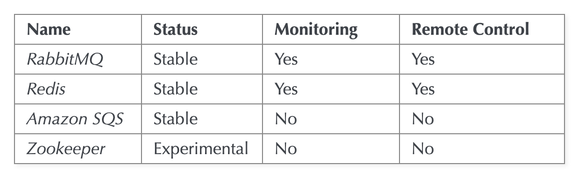

# kubernetes에서 redis운영

나는 셀러리 브로커로 redis를 사용중이었음.

그런데, kubernetes 운영중 여러 이유로 redis가 죽을때가 있음.

* probs(readiness, liveness) 셋팅이슈로 앱이 죽거나 다시 실행될 수 있음.
* 모든 앱에서 `resources.limits` 를 셋팅해주지 않으면, 이러한 pod들에 의해 영향 받을 수 있음

그래서 브로커로 뭘 쓸수 있는지 보니...

### celery broker로 사용할 수 있는 것들

> 

생각한 해결책들?

* redis cluster:	

  * redis cluster를 사용해서 하려고 했음
  * redis cluster의 경우 `MOVED` 같은걸 지원해줘야 함..
  * celery에서는 공식지원없음. Third-party도 backend만 지원이 있고 broker쪽엔 안보임.
* Amazon sqs사용:

  * queue이외 각각의 worker마다 추가적으로 namespace가 aws sqs에 생김....
  * update있을때마다... 다른게 생겨서 보기 불편해짐.
  * 비용도 생각보다 싸지 않음.. 
* redis single을 사용하되 안전하게 사용하는 방법.

쿠버네티스 환경에서는 언제든 노드가 죽고 다시 실행될 수 있다고 가정해야 하기에 클러스터가 적합해 보이지만, celery공식지원이 없음... 개발해볼만 할듯.

redis cluster 만드는건 kubedb reids에서 쉽게 가능. https://kubedb.com/docs/v0.13.0-rc.0/guides/redis/clustering/redis-cluster/

하지만 쉬운방법으로 일단 해결하고자함.

Redis single을 사용하되 resource관리를 철저희 할수 있는 노드로 이전하기로 결정. 왜냐면, 현재 브로커쪽 리소스가 그렇게 많이 필요하지 않기에, 클러스터로 구성하는건 오버스펙임.

