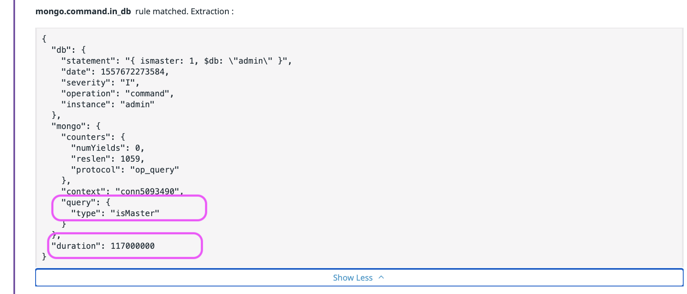

# [Datadog] mgo collection별 시간보기

## mongodb op time보기

mongodb를 운영중인데, 각 collection별 혹은 command별로 overhead를 보고 싶었음. 즉 database쪽 모니터링이 없는 상황에서 가끔 느려지는 쿼리때문에 한번 보고 싶었음. 쉬운방법으로는 mongodb cloud인 [atlas](https://www.mongodb.com/cloud/atlas)를 이용하면 됨. 제공해 주는것도 많고 가격도 괜찮은듯. 심각하게 옮기려고 고려중이었음. 그런데 DD(Datadog)를 셋업하고 나니 mongodb를 integration할수 있는 항목이 있네.. 개꿀..

일단 쉽게 integration이 되어서 셋팅은 했는데 기본 모니터링에 원하는게 없네..? 그래서 log에서 따로 duration가져와서 dashboard에 추가함. 참 쉬웠음...

설명은 아래에..

1. `Integrations > Integrations` 에 들어가서 `mongodb` 를 검색하고 활성화 해준다.
  * 
2. 활성화 하기 위해서는 몽고디비에 몇가지 셋팅을 해야한다. (런타임중에 가능)
2. 하고나면 mongodb 전용대시보드에서 상태를 볼수 있다. 하지만 각 op time을 보여주지는 않는다. 
  * 
3. `Logs > configuration > Pipeline` 으로 이동
  * 
4. Mongodb 로그파싱중에 mongo.command.in_db라고 있음. 이녀석이 op, collection, duration을 파싱해줌
  * 
  * 
5. 그래서 이걸 클론함. 그러면 내 pipeline에 생겨있는걸 확인할수 있음.
  * 
  * 
6. `Logs` 에서 `facets` 에 관련 attribute(op, collection) 를 추가해줌.(일단 collection만 추가해둠)
  * 
7. 몇분 기다리면 attibute로 collection term이 생기는걸 확인
  * 
9. dashboard에서 timeseries로 아이템 생성
9. Logevents로 셋하고, source:mongo로 필터링한후, 첫컬럼에 Duration으로 셋, max/avg/min은 선택후 위에서 추가한 facet인 collection으로 group하면 각 컬렉션 별로 max볼수 있음. 맨 우측에 limit가 있는데 collection이 많다면 늘려주면 됨
  * 
  * 

