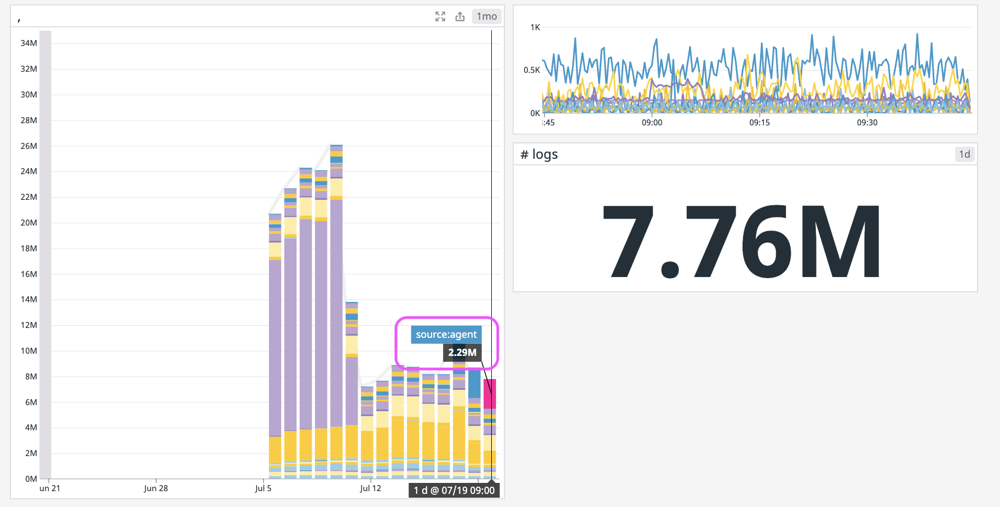
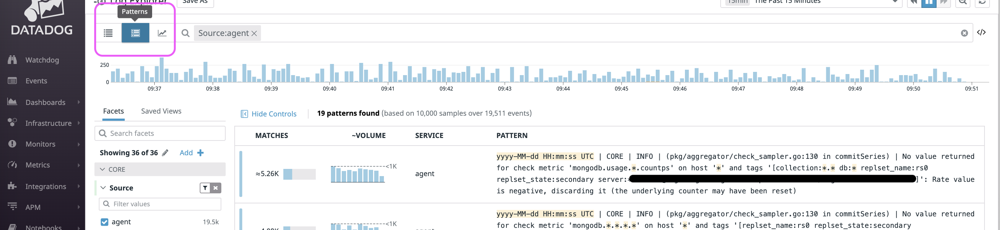
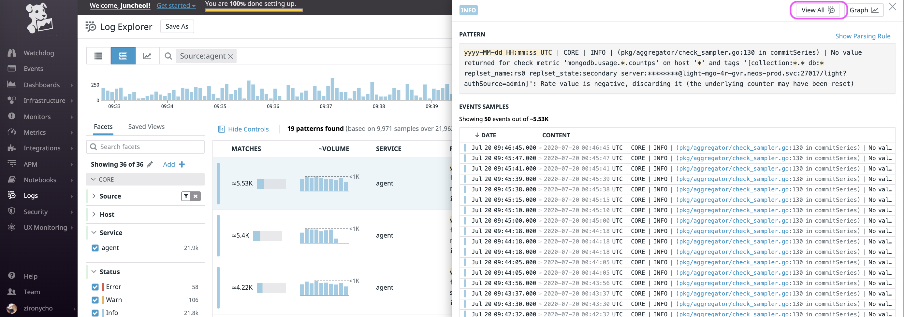
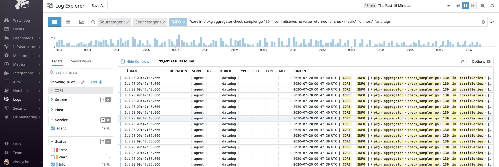
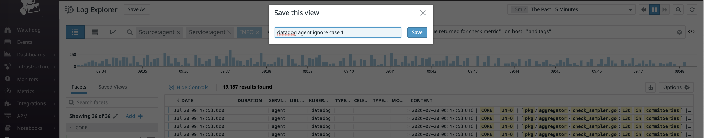
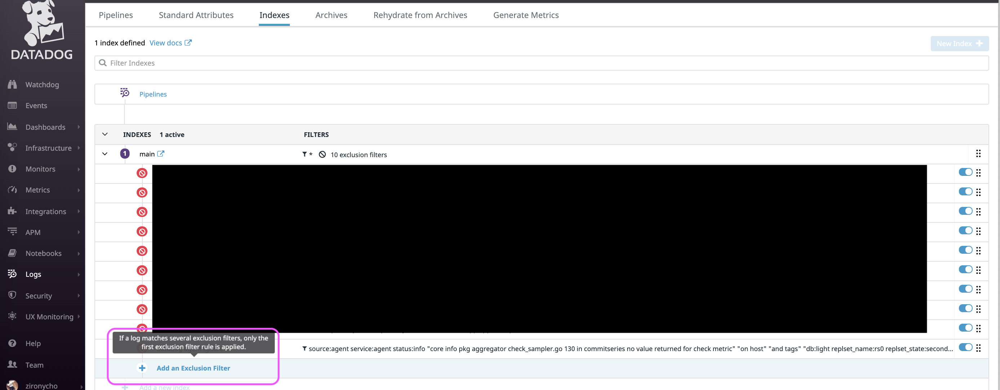
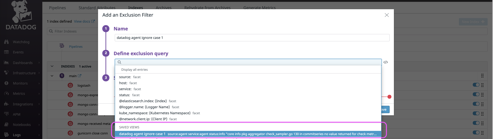

[Home](/README.md)

# [Datadog] log 갯수 줄이기

Datadog = (데이터개시끼) 

## 사용하지 않는 로그 필터링하기(비용절감)

DD(Datadog) 의 좋은점은 agent에서는 일단 무조건 로그를 쏘고, DD서버에서 필터링을 한다는점임. 이게 왜 좋냐면, 나같이 생각없이 일단 필요한 찍어보자는 식으로 로그를 만들었던 경우, 많은양이 전달될수 있어서? 그리고 운영중인 다른 서비스들에 대해서 일단은 다 받아보고 필요에 따라서 로깅할지 말지를 나중에 결정할 수 있어서.

전반적인 흐름은 `Logs > configure > indexes ` 에서 보지 않을 로그를 filtering 해 주면 됨. 이걸 좀 편하게 하기 위해서 아래처럼 `logs > pattern` 탭에서 미리 보고 싶은 않은 pattern을 쉽게 preset해두고 그걸 보지 않는쪽에 등록해 둘수 있는점임. 

그래서 아래는 그걸 위한 설명.

1. 전체사용량보기 (source단위로 봄)
  * 
1. 1일 주기로 한달동안 사용하는 양체크
1. 줄이고 싶은 소스체크 (ex. source:agent)
1. `Logs > pattern`로 이동
  * 
1. 줄이고 싶은 소스를 체크하고, 어떤 로그 패턴들이 있는지 봄.
1. 많으면서 필요없다고 생각되는것, 보고 싶지 않은 로그패턴 클릭후 `view all` 클릭
  * 
  * 
1. `save as` 를 누르고 패턴을 추가해둠
  * 
1. `Logs > configure > indexes ` 들어가서 `Add an exclusion filter` 클릭
  * 
1. 위에서 저장했던 패턴을 바로 추가가능
  * 

