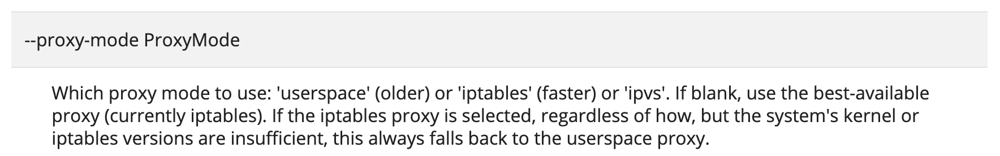

## About proxy-mode on Kubernetes

Kube-proxy가 service layer 관장. eksctl로 k8s를 사용중이기에 아무것도 모른채 사용중이었음. 당연히 RR로 있을줄 알았는데, Random이네.. 

node시작시 kube-proxy를 띄우는데 `--proxy-mode ProxyMode` 를 셋팅할수 있음. 현재 우리가 사용하는건 `iptables` . 그리고 셋팅없이 사용하더라도 기본은 iptables .

iptables 모드로 사용하게 되면 backend pod을 고를때 random이 된다.. 뜨아...

### more study next term:

* Kube-router
* calico
* ipvs

## refs:

https://kubernetes.io/docs/reference/command-line-tools-reference/kube-proxy/

https://kubernetes.io/docs/concepts/services-networking/service/#proxy-mode-iptables

https://www.kube-router.io/docs/user-guide/

https://hasura.io/blog/gke-vs-aks-vs-eks-411f080640dc/

https://kubernetes.io/blog/2018/07/09/ipvs-based-in-cluster-load-balancing-deep-dive/