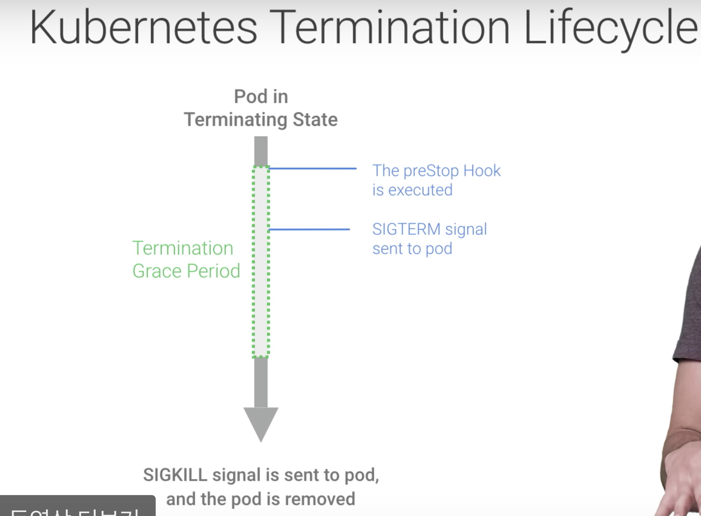
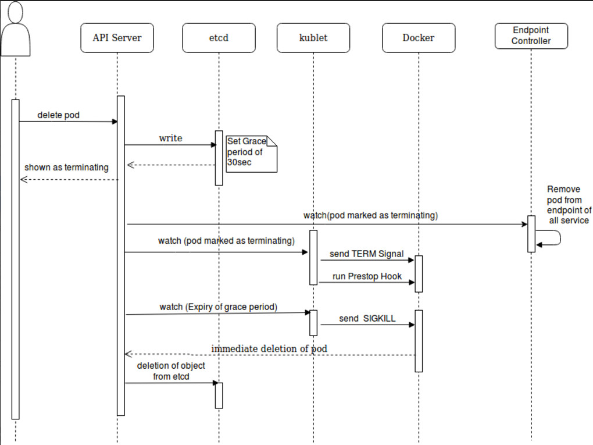
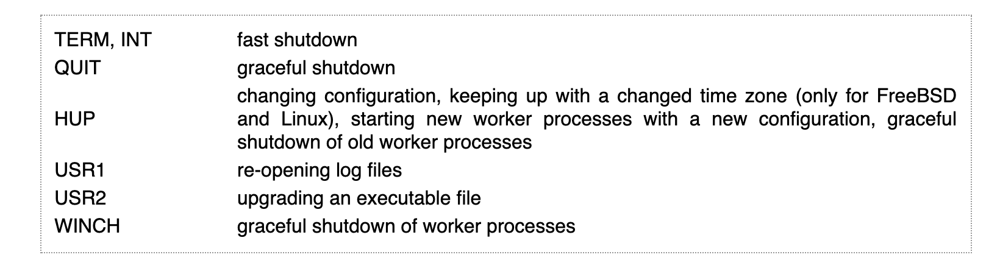

## kubernetes pod termination(gunicorn, nginx):

> 궁금증: nginx와 gunicorn은 graceful termination이 될까?


쿠버네티스 pod termination






* `prestop hook`은  SIGTERM을 처리하지 않는 애플리케이션이 팟에서 실행중일때, 애플리케이션을 수정하지 않고 사용자가 따로 처리할 수 있는 방법을 제공
* 기본은 30초 대기, 변경원하면 아래처럼 recipe작성: `terminationGracePeriodSeconds`

```yaml
apiVersion: apps/v1
kind: Deployment
...
spec:
  template:
    spec:
      terminationGracePeriodSeconds: 60
      containers:
        - name: test
        ...
```


# gunicorn graceful shutdown - by SIGTERM

클라이언트 접속중에 graceful shutdown을 하는 지 궁금해서 아래처럼 시나리오를 만들고 docker stop을 날림.

쿠버네티스에서 굳이 하지 않은 이유는 `docker stop`도 `SIGTERM`을 보내기 때문에...


**Senario:**

* client request > 
* < response
* client request >
* `SIGTERM`
* < response
* exit

```
## test.py
while True:
  print(requests.get('http://localhost'))
  time.sleep(1)

---
## gunicorn log
api_1             | [2020-03-05 09:31:51 +0900] [7] [INFO] Booting worker with pid: 7
api_1             | [2020-03-05 09:31:51 +0900] [1] [DEBUG] 1 workers
api_1             | [2020-03-05 09:32:05 +0900] [7] [DEBUG] GET /
api_1             | [2020-03-05 09:32:25 +0900] [7] [DEBUG] Closing connection. 
api_1             | [2020-03-05 09:32:26 +0900] [7] [DEBUG] GET /
api_1             | [2020-03-05 09:32:30 +0900] [1] [INFO] Handling signal: term
api_1             | [2020-03-05 09:32:46 +0900] [7] [DEBUG] Closing connection. 
api_1             | [2020-03-05 09:32:47 +0900] [7] [INFO] Worker exiting (pid: 7)
api_1             | [2020-03-05 09:32:47 +0900] [1] [INFO] Shutting down: Master
```


##nginx graceful shutdown - by SIGQUIT

https://ubuntu.com/blog/avoiding-dropped-connections-in-nginx-containers-with-stopsignal-sigquit



내용을 확인해 보면, docker stop을 하게 될 경우, sigterm이 아니라 `SIGQUIT`을 보낸다. 그렇다면 팟이 삭제될 경우, 혹은 롤링업데이트 후에 이 팟에 커넥션이 있는 애들은 모두 중간에 커넥션이 끊기게 된다... 


kubernetes나, docker run에서 graceful shutdown을 하기위해서는 Dockerfile에 아래와 같이 작성해야함

```dockerfile
FROM nginx
...
STOPSIGNAL SIGQUIT
...
```


## refs:

* https://cloud.google.com/blog/products/gcp/kubernetes-best-practices-terminating-with-grace
* https://pracucci.com/graceful-shutdown-of-kubernetes-pods.html
* https://ubuntu.com/blog/avoiding-dropped-connections-in-nginx-containers-with-stopsignal-sigquit
* img: https://dzone.com/articles/kubernetes-lifecycle-of-a-pod
* https://github.com/nginxinc/docker-nginx/issues/167
* http://nginx.org/en/docs/control.html