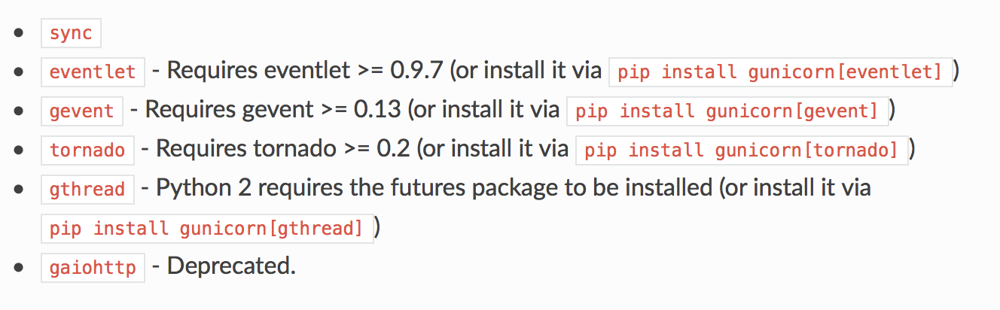

# Async worker in python web framework: Flask and Sanic


## How to use async worker for gunicorn

### Command parameter for worker class 

`--worker-class {{ STRING }}` or ` -k {{ STRING }}`



### Test code

```python
from flask import Flask, jsonify
import time

application = Flask(__name__)
step = 0


@application.route('/', methods=['GET'])
def hello():
  global step
  print(f'hello {step}')
  step += 1
  time.sleep(10)
  print('world')
  return jsonify({})

```


## gevent w/o coding

### Run:

```bash
$ gunicorn wsgi --worker-class gevent

$ curl http://localhost:8000 &
$ curl http://localhost:8000 &
```

### Result (async):

```bash
[2018-08-28 15:07:29 +0900] [56393] [INFO] Starting gunicorn 19.9.0
[2018-08-28 15:07:29 +0900] [56393] [INFO] Listening at: http://127.0.0.1:8000 (56393)
[2018-08-28 15:07:29 +0900] [56393] [INFO] Using worker: gevent
[2018-08-28 15:07:29 +0900] [56396] [INFO] Booting worker with pid: 56396
hello 0
hello 1
world
world
```


## eventlet w/o coding

### Run:

```bash
$ gunicorn wsgi --worker-class eventlet

$ curl http://localhost:8000 &
$ curl http://localhost:8000 &
```


### Result (not async):

```bash
[2018-08-20 09:32:32 +0900] [99782] [INFO] Starting gunicorn 19.9.0
[2018-08-20 09:32:32 +0900] [99782] [INFO] Listening at: http://127.0.0.1:8000 (99782)
[2018-08-20 09:32:32 +0900] [99782] [INFO] Using worker: eventlet
[2018-08-20 09:32:32 +0900] [99786] [INFO] Booting worker with pid: 99786
hello 0
world
hello 1
world
```


## eventlet with monkey patch

### Code

* applied monkey_patch

```python
# wsgi.py
import eventlet						# import eventlet
eventlet.monkey_patch()				# using monkey_patch

from flask import Flask, jsonify
...
```

### Run:

```bash
$ gunicorn wsgi --worker-class eventlet

$ curl http://localhost:8000 &
$ curl http://localhost:8000 &
```


### Result (async):

```bash
[2018-08-20 09:36:23 +0900] [411] [INFO] Starting gunicorn 19.9.0
[2018-08-20 09:36:23 +0900] [411] [INFO] Listening at: http://127.0.0.1:8000 (411)
[2018-08-20 09:36:23 +0900] [411] [INFO] Using worker: eventlet
[2018-08-20 09:36:23 +0900] [416] [INFO] Booting worker with pid: 416
hello 0
hello 1
world
world
```


## sync worker-class with monkey patch

### Code

- applied monkey_patch

```python
# wsgi.py
import eventlet						# import eventlet
eventlet.monkey_patch()				# using monkey_patch

from flask import Flask, jsonify
...
```

### Run:

```bash
$ gunicorn wsgi

$ curl http://localhost:8000 &
$ curl http://localhost:8000 &
```


### Result (not async):

```bash
[2018-08-20 09:38:12 +0900] [753] [INFO] Starting gunicorn 19.9.0
[2018-08-20 09:38:12 +0900] [753] [INFO] Listening at: http://127.0.0.1:8000 (753)
[2018-08-20 09:38:12 +0900] [753] [INFO] Using worker: sync
[2018-08-20 09:38:12 +0900] [759] [INFO] Booting worker with pid: 759
hello 0
world
hello 1
world
```


## Sanic with time function

### Code

```python
# app.py

from sanic import Sanic
from sanic.response import json
import time

app = Sanic()
step = 0


@app.route('/')
async def test(request):
    global step
    print(f'hello {step}')
    step += 1
    time.sleep(10)
    print('world')
    return json({})

if __name__ == '__main__':
    app.run(host='0.0.0.0', port=8000)
```

### Run:

```bash
$ python app.py

$ curl http://localhost:8000 &
$ curl http://localhost:8000 &
```


### Result (error):

```bash
[2018-08-20 09:53:04 +0900] [2584] [INFO] Goin' Fast @ http://0.0.0.0:8000                                                                             [1/226]
[2018-08-20 09:53:04 +0900] [2584] [INFO] Starting worker [2584]
hello 0
[2018-08-20 09:53:17 +0900] [2584] [ERROR] Traceback (most recent call last):
  File "/Users/zironycho/envs/async/lib/python3.6/site-packages/sanic/app.py", line 556, in handle_request
    response = await response
  File "app.py", line 14, in test
    await time.sleep(10)
TypeError: object NoneType can't be used in 'await' expression

[2018-08-20 09:53:17 +0900] - (sanic.access)[INFO][1:2]: GET http://localhost:8000/  500 144
hello 1
[2018-08-20 09:53:27 +0900] [2584] [ERROR] Traceback (most recent call last):
  File "/Users/zironycho/envs/async/lib/python3.6/site-packages/sanic/app.py", line 556, in handle_request
    response = await response
  File "app.py", line 14, in test
    await time.sleep(10)
TypeError: object NoneType can't be used in 'await' expression

[2018-08-20 09:53:27 +0900] - (sanic.access)[INFO][1:2]: GET http://localhost:8000/  500 144
[2018-08-20 09:53:27 +0900] [2584] [INFO] KeepAlive Timeout. Closing connection.
```


## Sanic with async.time

### Code

```python
# app.py
...
@app.route('/')
async def test(request):
    ...
    step += 1
	import asyncio					# replace time to asyncio
    await asyncio.sleep(10)			# replace time.sleep to asyncio.time
    print('world')
    ...

if __name__ == '__main__':
    app.run(host='0.0.0.0', port=8000)
```

### Run:

```bash
$ python app.py

$ curl http://localhost:8000 &
$ curl http://localhost:8000 &
```


### Result (async):

```bash
[2018-08-20 09:55:25 +0900] [2871] [INFO] Goin' Fast @ http://0.0.0.0:8000
[2018-08-20 09:55:25 +0900] [2871] [INFO] Starting worker [2871]
hello 0
hello 1
world
[2018-08-20 09:55:39 +0900] - (sanic.access)[INFO][1:2]: GET http://localhost:8000/  200 2
world
[2018-08-20 09:55:39 +0900] - (sanic.access)[INFO][1:2]: GET http://localhost:8000/  200 2
```


## Benchmark

- tool: [wrk](https://github.com/wg/wrk)
- task:
  - threads: 12
  - connections: 400
  - 30sec

|                                | sleep 10 sec | w/o sleep |
| ------------------------------ | ------------ | --------- |
| flask gunicorn sync            | 3            | 13,284    |
| flask gunicorn async(eventlet) | 814          | 35,448    |
| flask gunicorn async(gevent)   | 842          | 37,746    |
| sanic                          | 817          | 126,538   |
| sanic gunicorn                 |              | 51,573    |


## References

* http://docs.gunicorn.org/en/stable/settings.html
* https://github.com/channelcat/sanic
* https://github.com/wg/wrk
* https://blog.signifai.io/not-your-fathers-python-amazing-powerful-frameworks/

