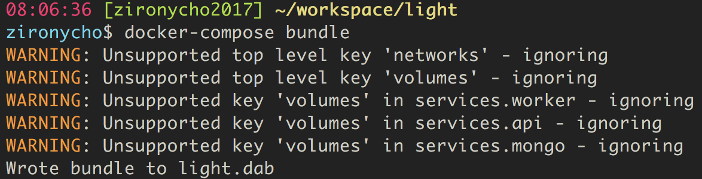

# docker-compose에서 swarm으로 
By [zironycho](http://github.com/zironycho) :heart: [Neosapience, Inc](http://www.neosapience.com)

**2018.02.24**

<br><br><br>
## 목차
* 어떤 사람을 위한 문서인가?
* 시작하게 된 배경
* docker-compose, swarm 간단하게
* swarm으로 넘어가기
* 이후계획

<br><br><br><br><br><br><br><br><br><br><br><br>
## 어떤 사람을 위한 문서인가?
* `docker`, `docker-compose`를 완전히는 모르더라도 대충이라도 써 본 사람
* `orchestration` 에 대해서 고민해 보는 단계, 하지만 아직 적용은 안 해본 사람.

<br><br><br><br><br><br><br><br><br><br><br><br>
## 시작하게 된 배경
micro service를 만들기 위해서 docker를 사용하게 되었고, 간단한 웹 앱을 만들고 있었다.
전체적인 서비스의 구성은 아래와 같다.
```
[nginx] -> [vuejs]
        -> [flask] -> [redis queue] -> [celery job] -> [tts api]
        -> [mongo]
```
그다지 복잡하지 않은 구성이어서 machine하나에 docker-compose로 구성해서 다 올리고 싶었다. 하지만, `[tts api]` 부분이 한 문장을 작업하는데 수초가 걸리는 작업이고(gpu를 사용하면 0.5초 걸린다), 혼자 웹서비스를 이용한다고 하더라도 이부분은 부하가 많이 걸렸다. 이 부분을 작은 리소스를 사용하는 컴퓨팅 머신을 활용해서 scale을 늘린다면 좋을 것이라고 생각했다. 그러기 위해서는 오케스트레이션이 필요했다.

<br><br><br><br><br><br><br><br><br><br><br><br>
## docker-compose, swarm 간단하게

### docker-compose 란
* 여러 컨테이너들을 한 번에 수행시킬 수 있는 툴.
* yaml형식으로 되있다.
```yaml
version: '3'
services:
  web:
    build: ./api
    ports:
    - "8080:80"
    volumes:
    - ./api:/code
    - logvolume01:/var/log
    networks:
    - backend
  redis:
    image: redis
volumes:
  logvolume01: {}
networks:
  backend:
    driver:bridge
```
* `docker-compose up`을 하게되면 `docker-compose.yml`을 자동으로 실행한다.
* `scale`을 할 수 있지만, 한개의 docker machine에서만 가능하다. 즉 node가 하나인 셈이다.
* `Pycharm`을 이용하면 docker-compose의 환경에서 python app을 디버깅 할 수 있다.

### swarm 이란
* docker machine(engine)들을 cluster로 구성하고 서비스 형태로 도커를 수행시킨다.
* `docker run` 대신 `docker service create`
* ingress router mesh
  * 모든 노드로 접속이 가능하며 swarm이 알아서 분산해준다.
  * 접속한 노드에 docker가 수행되지 않고 있더라도 swarm내부에서 수행중인 녀석을 찾아서 실행해준다.
  * 

* initialize cluster
```bash
$ docker swarm init
Swarm initialized: current node (vyec7a6s7j2amgb5bvsi66qj5) is now a manager.

To add a worker to this swarm, run the following command:

    docker swarm join --token SWMTKN-1-1p9mpawlbk79mn7lx4egqm6ydu1tg2pqnefy6t0t791lc1grvx-ef4nnbpaeejjqepjf811tr6em 172.17.8.101:2377

To add a manager to this swarm, run 'docker swarm join-token manager' and follow the instructions.
```
* attach to cluster
```bash
$ docker swarm join {{token}} {{ip:port}}
```

<br><br><br><br><br><br><br><br><br><br><br><br>
## swarm으로 넘어가기

### swarm으로 cluster구성
* test: [coreos vagrant](https://github.com/coreos/coreos-vagrant.git)
  * `Vagrantfile`에서 `$num_instances`를 수정해서 node 갯수를 늘릴 수 있다.
* aws:
  * `coreos`이용하면 docker까지 설치되어 있음.
  * security를 vpc내부망으로 제약하면 port셋팅안하고 다 풀어두면 됨.
  * aws load balancer를 이용해서 open할 포트만 따로 지정해서 열어둠.
  * ports 

|Type | Protocol | Ports | Source|
|-----|----------|-------|--------|
|Custom TCP Rule| TCP| 2377|  swarm + remote mgmt|
|Custom TCP Rule| TCP| 7946|  swarm|
|Custom UDP Rule| UDP| 7946|  swarm|
|Custom UDP Rule| UDP| 4789|  swarm|

### 컨테이너 실행하기
* `docker service create`를 통해 하나씩 서비스 등록해서 사용
* docker-compose로 구성되어 있다면 `docker stack`을 이용해서 한 번에 올릴 수 있음.

### deploy / stack 사용하여 컨테이너 실행
* 실험적인 단계라 아직 부족한 점이 많음
* `docker deploy` 혹은 `docker stack` 을 이용하면 docker-compose를 이용가능

#### bundling & deploy
```bash
$ docker-compose bundle
$ docker deploy --file {{ dab_file }} {{ name_of_stack }}
```
* 문제점: 
  * `/volumes` setting 날아가고, `/services` 밑의 volume 셋팅도 날아감.
  * `/networks` setting 날아감, `/services` 밑의 network 셋팅은 유지됨.
  * 

#### stack을 이용
```bash
$ docker stack deploy -c docker-compose.yml {{ name_of_stack }}
```
* 문제점: 
  * `.env` 적용안됨. [.env 란](https://docs.docker.com/compose/environment-variables/#passing-environment-variables-through-to-containers)
  * compose file override 적용이 안되고 오직 한 compose file만 사용가능. [관련링크](https://docs.docker.com/compose/extends/#example-use-case)

#### volume에 넣어둔 코드들 제거(full dockerize)
```yaml
services:
  web:
    build: ./api
    image: quay.io/neos/app:v1
    volumes:
    - ./api:/code
```
* swarm에서 실행시 build는 무시된다.
* swarm에서 실행시 image를 regstry에서 다운받아서 하기 때문에 `docker-compose push`를 통해 이미지를 모두 올려야 한다.
* `image`안에 모든 코드가 들어가야 함. 
* 하지만 volume을 local을 셋팅하지 않고, volume container를 사용한다면 상관 없을 듯.

#### network 따로 생성
* driver를 bridge가 아닌 overlay로 해줘야 swarm에 있는 모든 서비스들이 사용가능
* stack으로 올리는 것 이외에 다른 서비스에서 이용하기 위해서 아래와 같이 작업
```
# docker-compose.yml, version format >=3.3
networks:
  backend:
    bridge: overlay
    attachable: true
```

* 위와같이 구성하게 되면 network 이름이 {{stack_name}}{{network name}} 으로 구성된다. 만약 `stack_name`을 지우고 싶다면 아래처럼 구성할 수 있다.
* attachable을 사용하는 이유는 추가로 디버깅용 앱을 저 network에 붙이기 위해서 사용했다.
```
docker network create --attachable \
  --driver overlay \
  {{ network_name }}
```

```yaml
# docker-compose.yml
networks:
  backend:
    exnernal:
      name: backend
```

#### volume mount (s3, ebs, efs, ...) 
* using rexray.io 를 이용해서 데이터 볼륨을 마운트
```
# download rexray package
$ curl -sSL https://dl.bintray.com/emccode/rexray/install | sh

# docker plugin
$ docker plugin install rexray/s3fs \
  --grant-all-permissions \
  S3FS_ACCESSKEY={{ key }} \
  S3FS_SECRETKEY={{ key }} \
  S3FS_REGION={{ key }}
```

* `docker-compose.yml`
```yaml
volumes:
  my-data:
    driver: rexray/s3fs
```

* mongo data를 ebs로 연결시, 하나의 포인트를 access하게 되면 문제가 있을듯.

#### private registry
- quay.io를 사용했는데, 클러스터에 참여하는 모든 노드들이 `docker login quay.io`를 통해 로그인해야함
- `--with-registry-auth` 옵션도 항상 붙어다님.
- docker service에 나만의 registry를 올릴 수도 있다.


<br><br><br><br><br><br><br><br><br><br><br><br>
## 이후계획
- k8s 공부
- coreos tectonic 사용
- https://traefik.io 구성해서 reverse proxy구성

<br><br><br><br><br><br><br><br><br><br><br><br>
## References
- https://docs.docker.com/compose/overview/
- https://subicura.com/2017/02/25/container-orchestration-with-docker-swarm.html
- https://docs.docker.com/engine/swarm/ingress/
- https://gist.github.com/BretFisher/7233b7ecf14bc49eb47715bbeb2a2769
- https://docs.docker.com/compose/bundles/
