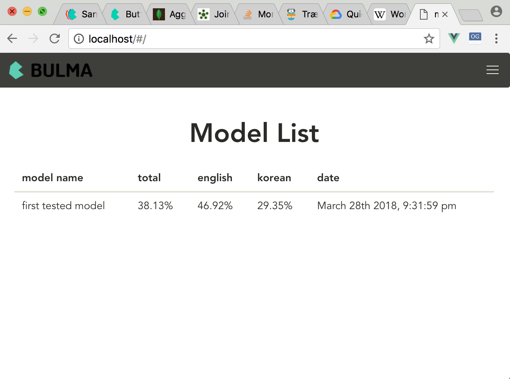
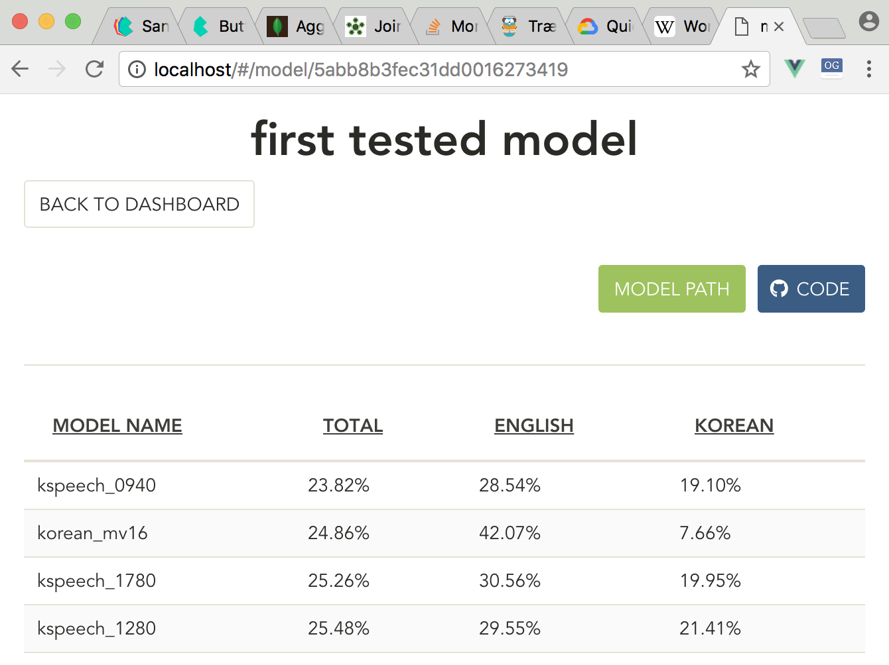
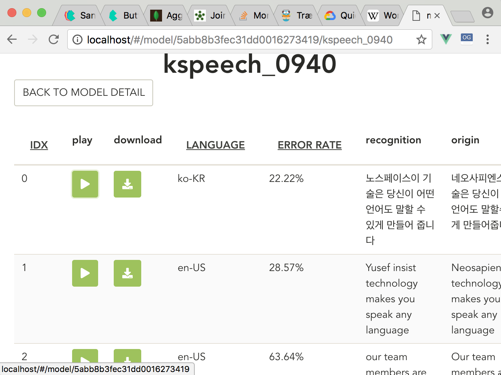

# MongoDB Aggregation
By [zironycho](http://github.com/zironycho) :heart: [Neosapience, Inc.](http://www.neosapience.com)

**2018.03.31**

## 배경
> 하루 사용한 몽고디비 `aggregate`를 정리해보려고...
여러 화자를 사용해서 TTS를 모델링하고 나서 각각의 사람의 성능을 평가해 보고 싶었다. 그래서 몇개의 미리 정해둔 글자로 `wav`를 생성한 후, `google speech api`를 이용해서 음성을 인식시켜서 `text`로 변환한다. 그리고 마지막으로 실제와 얼마나 다른지 `Word error rate`을 이용해서 측정해본다. 사실 엑셀로 정리해서 봤었는데, 음성도 듣고 싶어서 이렇게 열심히 만들었다. 그리고 이런 모델이 더 늘어날 수 있다고 가정을 했기 때문에 디비로 작업하면 좋을 것 같다고 생각했다.

* 아래와 같은 작업순서..
`tts modeling` -> `generate 18 wav files each actor` -> `speech to text api` -> `wer measure` -> `db`

<br><br><br><br><br><br><br><br><br><br><br><br>
## MongoDB 툴들
* mongo shell
  * visualization이 안되서 보기가 힘듬
* [MongoDB Compass](https://www.mongodb.com/products/compass)
  * aggregate를 해볼수는 없음.
* [Studio 3T](https://studio3t.com/)
  * aggregate가능
  * not free
  * UI구림..
* [dbKoda](https://www.dbkoda.com/)
  * UI예쁜 오픈소스
  * aggregate가능하다고 그림은 보임..
  * 난 안됨.. 뭐지..

<br><br><br><br><br><br><br><br><br><br><br><br>
## Document 구조
```json
{ 
  "_id" : ObjectId("5abb6c426e61a1de40c967c1"), 
  "name" : "first tested model", 
  "model_path" : "62_40th.t7", 
  "model_code" : "https://github.com/neosapience/Tacotron2-multi/tree/847df4bb151521fff08b69e63ba5ead8d911ff65", 
  "model_type" : "multi-speaker", 
  "users" : [
    {
      "name" : "kspeech_0320", 
      "sentences" : [
        {
          "idx" : NumberInt(0), 
          "lang" : "ko-KR", 
          "origin" : "네오사피엔스의 기술은 당신이 어떤 언어도 말할수 있게 만들어줍니다", 
          "recogn" : "USB 인식 기술을 당신이 어떤 알아들을 수 있게 만들어 줍니다", 
          "error_rate" : 41.6666666667, 
          "wav_path" : "1_t0_kspeech_0320.wav"
        },
        ...
      ] //end of sentences
    },
    ...
  ] //end of users
}
```
<br><br><br><br>
### 하려는 것
`models` > `users(actors)` > `sentences`. 이와 같은 깊이를 갖는 데이터가 있었고, `word error rate`에 대해서 평균을 보고 싶었기 때문에 사실 먼저 다 구해놓고 디비에 저장하면 가볍게 구현했겠지만. 그냥 `aggregate` 한 번 써보고 싶었다.

<br><br><br><br>
### db.{collection}.aggregate()

* pipeline stages
* pipeline operations


*image from [mongodb site](https://docs.mongodb.com/manual/aggregation/)*

>SQL mapping
```sql
SELECT cust_id,
       SUM(price) as total
FROM orders
WHERE status = 'A'
GROUP BY cust_id
```

<br><br><br><br>
### `$unwind`
>원하는 field가 list안에 있다면 이것을 사용해서 list를 풀어줘야 한다. 내가 조회하고 싶은 field는 `users.sentences.error_rate`이다.

<br><br>
* 먼저 `users`에 대해서 풀어준다.
```vv
db.models.aggregate([
    { $unwind: "$users" }
])
```
```json

{ 
    "_id" : ObjectId("5abb6c426e61a1de40c967c1"), 
    "name" : "first tested model", 
    "model_path" : "62_40th.t7", 
    "model_code" : "https://github.com/neosapience/Tacotron2-multi/tree/847df4bb151521fff08b69e63ba5ead8d911ff65", 
    "model_type" : "multi-speaker", 
    "users" : {
        "name" : "kspeech_0320", 
        "sentences" : [
            {
                "idx" : NumberInt(0), 
                "lang" : "ko-KR", 
                "origin" : "네오사피엔스의 기술은 당신이 어떤 언어도 말할수 있게 만들어줍니다", 
                "recogn" : "USB 인식 기술을 당신이 어떤 알아들을 수 있게 만들어 줍니다", 
                "error_rate" : 41.6666666667, 
                "wav_path" : "1_t0_kspeech_0320.wav"
            },
            ...
        ]
    }
}
{ 
    "_id" : ObjectId("5abb6c426e61a1de40c967c1"), 
    "name" : "first tested model", 
    "model_path" : "62_40th.t7", 
    "model_code" : "https://github.com/neosapience/Tacotron2-multi/tree/847df4bb151521fff08b69e63ba5ead8d911ff65", 
    "model_type" : "multi-speaker", 
    "users" : {
        "name" : "vctk_p252", 
        "sentences" : [...]
    }
}
...
```

<br><br>
* 한번더 `sentences`에 대해서 풀어준다.

```vv
db.models.aggregate([
    { $unwind: "$users" },
    { $unwind: "$users.sentences" }
])
```
```json
{ 
    "_id" : ObjectId("5abb6c426e61a1de40c967c1"), 
    "name" : "first tested model", 
    "model_path" : "62_40th.t7", 
    "model_code" : "https://github.com/neosapience/Tacotron2-multi/tree/847df4bb151521fff08b69e63ba5ead8d911ff65", 
    "model_type" : "multi-speaker", 
    "users" : {
        "name" : "kspeech_0320", 
        "sentences" : {
            "idx" : NumberInt(0), 
            "lang" : "ko-KR", 
            "origin" : "네오사피엔스의 기술은 당신이 어떤 언어도 말할수 있게 만들어줍니다", 
            "recogn" : "USB 인식 기술을 당신이 어떤 알아들을 수 있게 만들어 줍니다", 
            "error_rate" : 41.6666666667, 
            "wav_path" : "1_t0_kspeech_0320.wav"
        }
    }
}
{ 
    "_id" : ObjectId("5abb6c426e61a1de40c967c1"), 
    "name" : "first tested model", 
    "model_path" : "62_40th.t7", 
    "model_code" : "https://github.com/neosapience/Tacotron2-multi/tree/847df4bb151521fff08b69e63ba5ead8d911ff65", 
    "model_type" : "multi-speaker", 
    "users" : {
        "name" : "kspeech_0320", 
        "sentences" : {
            "idx" : NumberInt(17), 
            "lang" : "ko-KR", 
            "origin" : "조지 워싱턴은 미국의 초대 대통령이다", 
            "recogn" : "저주받은 차는 미국의 초대 대통령이다", 
            "error_rate" : 35.0, 
            "wav_path" : "1_t17_kspeech_0320.wav"
        }
    }
}
...
```

<br><br><br><br>
### `$group`
> `_id`를 정의해줘야 합니다. 이건 distinct key가 됩니다. null을 넣어 줄 수도 있습니다. 그러면 하나의 아웃풋으로 만들어 집니다. 그리고 field와 그 field의 값으로는 계산하는 형식으로 정의해 줘야합니다. 아래처럼..
```
{ $group: { _id: <expression>, <field1>: { <accumulator1> : <expression1> }, ... } }
```

<br><br>
* 현재 영어와 한국어 두개에 대해서 따로 평균을 구해줘야 합니다. 그래서 lang를 기준으로 키를 `_id` 로 잡았습니다. error_rate은 `$avg`를 사용해서 평균을 구했습니다. 그리고 `database name`을 뒤로 넘겨주기 위해서 `$last`를 사용했습니다.
```m
db.models.aggregate([
    { $unwind: "$users" },
    { $unwind: "$users.sentences" },
    { $group: {
        _id: {"lang": "$users.sentences.lang"},
        error_rate: {$avg:"$users.sentences.error_rate"},
        name: {$last: "$name"}
    }},
])
```

<br><br>
```
{ 
    "_id" : {
        "lang" : "en-US"
    }, 
    "error_rate" : 46.91585089907153, 
    "name" : "first tested model"
}
{ 
    "_id" : {
        "lang" : "ko-KR"
    }, 
    "error_rate" : 29.352618118165463, 
    "name" : "first tested model"
}
```

<br><br><br><br>
* 그리고 전체에 대해서도 평균을 구해줘야 합니다. 그리고 기존에 구했던 언어별 평균값도 뒤로 넘겨줘야 합니다. 그래서 `$push`를 사용해서 모든 문서를 뒤로 넘겨주었습니다. 여기서 저는 `k, v`를 사용해서 lang과 error_rate을 전달했습니다. `$push`를 사용하게 되면 array로 넘어가게 되는데, 저는 이것을 object형태로 바꾸주고 싶었습니다.
```m
db.models.aggregate([
    { $unwind: "$users" },
    { $unwind: "$users.sentences" },
    { $group: {
        _id: {"lang": "$users.sentences.lang"},
        error_rate: {$avg:"$users.sentences.error_rate"},
        name: {$last: "$name"}
    }},
    { $group: {
        _id: "null",
        total: {$avg: "$error_rate"},
        subs: {$push: {"k": "$_id.lang", "v": "$error_rate"}},
        name: {$last: "$name"}
    }},
])
```

<br><br>
```json
{ 
    "_id" : "null", 
    "total" : 38.1342345086185, 
    "subs" : [
        {
            "k" : "en-US", 
            "v" : 46.91585089907153
        }, 
        {
            "k" : "ko-KR", 
            "v" : 29.352618118165463
        }
    ], 
    "name" : "first tested model"
}
```

<br><br><br><br>
### `$project`
>원하는 애들만 선택해서 아웃풋으로 전달하거나, 다른 이름으로 할당해서 값을 줄 수 있습니다. `_id`를 0으로 주면 _id 값만 빼고 나머지를 다 아웃풋으로 전달합니다. 그러나 그외의 필드를 명시하게 될 경우, 명시하지 않은 필드에 대해서는 아웃풋을 전달하지 않습니다.


* metrics라는 필드를 새로 추가했고, subs에는 `$arrayToObject`를 사용했습니다. 여기서 array안에 `k, v`를 파싱해서 오브젝트로 반환합니다.
```
db.models.aggregate([
    { $unwind: "$users" },
    { $unwind: "$users.sentences" },
    { $group: {
        _id: {"lang": "$users.sentences.lang"},
        error_rate: {$avg:"$users.sentences.error_rate"},
        name: {$last: "$name"}
    }},
    { $group: {
        _id: "null",
        total: {$avg: "$error_rate"},
        subs: {$push: {"k": "$_id.lang", "v": "$error_rate"}},
        name: {$last: "$name"}
    }},
    { $project: {
        name: 1,
        metrics: {
            total: $total,
            subs: {$arrayToObject: "$subs"}
        }
    }}
])
```

<br><br>
```
{
    "_id" : "null", 
    "name" : "first tested model", 
    "metrics" : { 
        "total" : 38.1342345086185, 
        "subs" : { 
            "en-US" : 46.91585089907153, 
            "ko-KR" : 29.352618118165463
        }
    }
}
```

<br><br><br><br>
### 다른쿼리들

* 각각의 `users`의 평균을 보고 싶었습니다. 각각의 유저가 언어도 여러개 가질 수 있으므로 `_id`를 보면 user이름 뿐만이 아닌 언어까지 추가로 distinct key를 구성했습니다.
```
db.models.aggregate([
    { $unwind: "$users"},
    { $unwind: "$users.sentences"},
    { $group: {
        _id: {"name": "$users.name", "lang": "$users.sentences.lang"},
        error_rate: {$avg: "$users.sentences.error_rate"},
        name: {$last: "$name"},
        oid: {$last: "$_id"},
    }},
    { $group: {
        _id: "$_id.name",
        total: {$avg: "$error_rate"},
        subs: {$push: {"k": "$_id.lang", "v": "$error_rate"}},
        name: {$last: "$name"},
        oid: {$last: "$oid"},
    }},
    { $project: {
        name: "$_id.name",
        metrics: {
            total: "$total",
            subs: {$arrayToObject: "$subs"}
        },
    }},
])
```

<br><br>
```
{ 
    "_id" : "kspeech_0070", 
    "metrics" : {
        "total" : 34.94930931777722, 
        "subs" : {
            "ko-KR" : 26.334204654454442, 
            "en-US" : 43.564413981099996
        }
    }
}
{ 
    "_id" : "etri_F_0", 
    "metrics" : {
        "total" : 44.097449363692775, 
        "subs" : {
            "ko-KR" : 17.73854952104111, 
            "en-US" : 70.45634920634444
        }
    }
}
...
```

<br><br><br><br>
* 한명의 `users`의 평균을 보고 싶었습니다. 그리고 각 문장의 error_rate도 보고 싶었습니다. 이 aggregate의 마지막 아웃풋은 한명의 유저에 대한 결과화면이기 때문에 sentences를 계속해서 다음 인풋으로 넘겨주었습니다. 총 18개의 문장 중에, 2개의 언어로 9문장씩 있으므로, 첫 번째 group에서 `sentences[2][9]` 이렇게 구성되어 버린다. 그래서 마지막 project에서 `$reduce`를 이용해서 하나의 array로 concatenate 시켜주었다.
```
db.models.aggregate([
    {$unwind: "$users"},
    {$match: {"users.name": "kspeech_0070"}},
    {$unwind: "$users.sentences"},
    {$group: {
        _id: {"name": "$users.name", "lang": "$users.sentences.lang"},
        error_rate: {$avg: "$users.sentences.error_rate"},
        name: {$last: "$name"},
        oid: {$last: "$_id"},
        sentences: {$push: "$users.sentences"}
    }},
    {$group: {
        _id: "$_id.name",
        total: {$avg: "$error_rate"},
        subs: {$push: {"k": "$_id.lang", "v": "$error_rate"}},
        name: {$last: "$name"},
        oid: {$last: "$oid"},
        sentences: {$push: "$sentences"}
    }},
    {$project: {
        name: "$_id.name",
        metrics: {
            total: "$total",
            subs: {$arrayToObject: "$subs"}
        },
        sentences: {$reduce: {
            input: "$sentences",
            initialValue: [],
            in: {$concatArrays: ["$$value", "$$this"]}
        }}
    }},
])
```

<br><br>
```
{ 
    "_id" : "etri_F_0", 
    "metrics" : {
        "total" : 44.097449363692775, 
        "subs" : {
            "en-US" : 70.45634920634444, 
            "ko-KR" : 17.73854952104111
        }
    }, 
    "sentences" : [
        {
            "idx" : NumberInt(6), 
            "lang" : "en-US", 
            "origin" : "Generative adversarial network or variational autoencoder", 
            "recogn" : "", 
            "error_rate" : 100.0, 
            "wav_path" : "1_t6_etri_F_0.wav"
        }, 
        {
            "idx" : NumberInt(1), 
            "lang" : "en-US", 
            "origin" : "Neosapiences technology makes you speak any language", 
            "recogn" : "Giuseppe sista collection makes you speak any language", 
            "error_rate" : 42.8571428571, 
            "wav_path" : "1_t1_etri_F_0.wav"
        },
        ...(18)
    ]
}
```

<br><br><br><br>
### 마지막 웹뷰로
1. 훈련된 모델들의 성능


<br><br>
2. 모델안의 유저별 성능


<br><br>
3. 유저안의 문장별 성능


<br><br><br><br>
## References
* https://docs.mongodb.com/manual/aggregation
* https://docs.mongodb.com/manual/reference/operator/aggregation-pipeline/
* https://docs.mongodb.com/manual/reference/operator/aggregation/