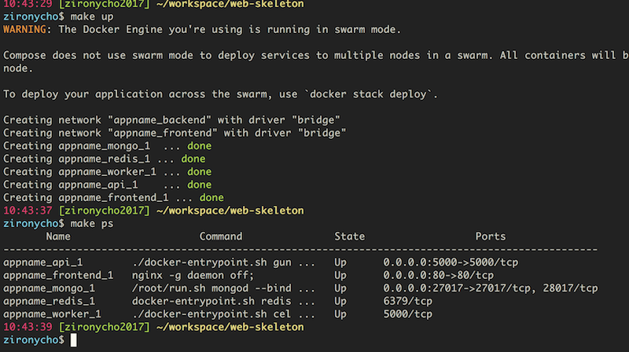
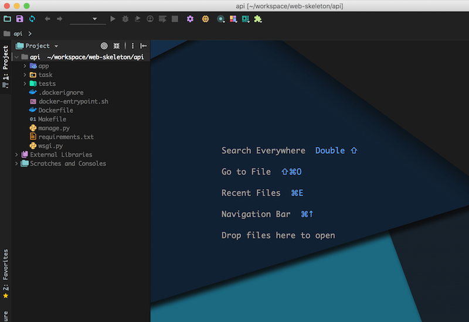
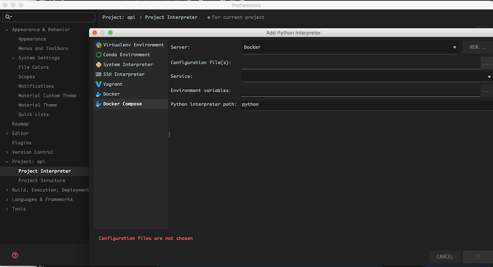
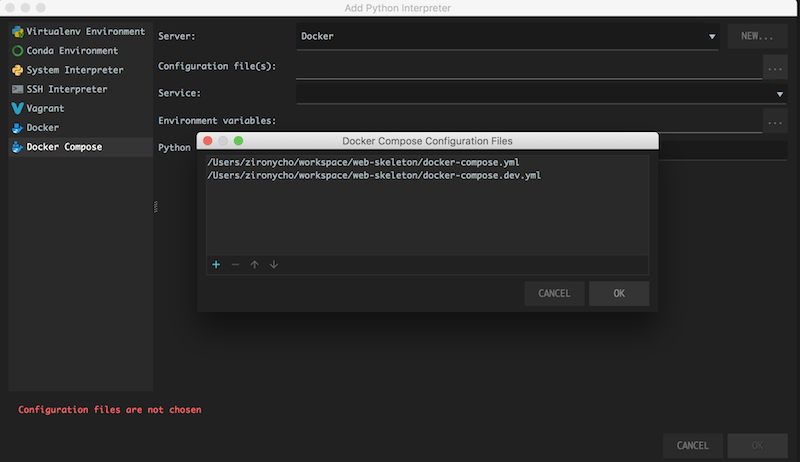
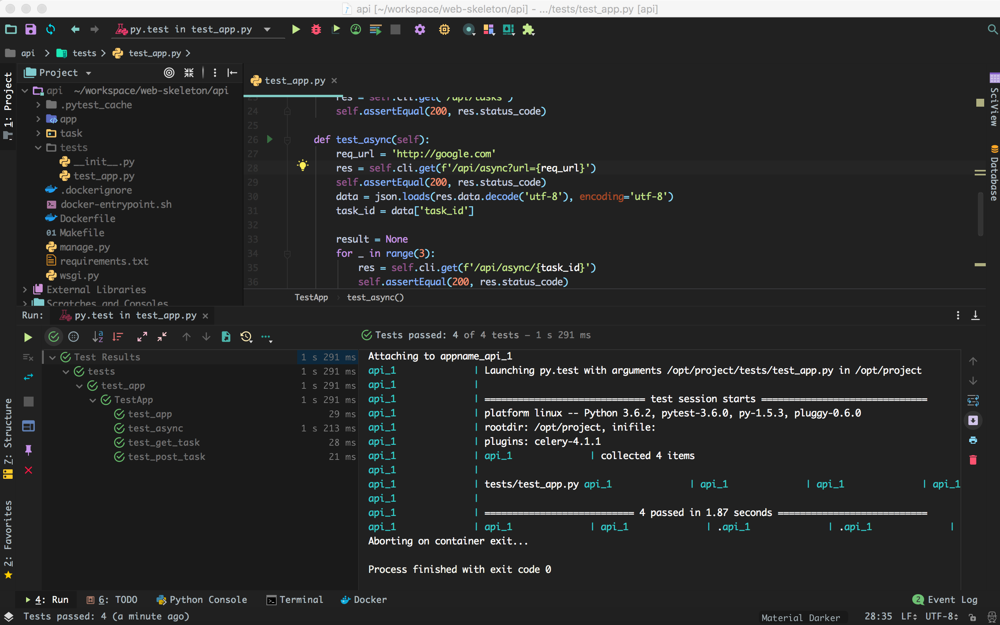
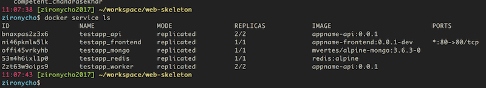

# `Flask`를 `docker-compose`환경에서 `Pycharm`을 이용해서 개발하고 `swarm`용으로 배포하기
By [zironycho](http://github.com/zironycho) :heart: [Neosapience, Inc](http://www.neosapience.com)
**2018.05.26**


---
## 들어가며
나의 경우 flask로 앱을 만들 때 아래의 스택을 주로 사용한다.
* flask + gunicorn (backend api)
* celery (async job scheduling)
* redis (message broker)
* mongo (database)
* vuejs (frontend)
* nginx

이 스택들을 묶어서 `docker compose`로 개발/작업하면 쉽고 빠르게 배포할 수 있다. `Pycharm`에서 `docker compose`의 지원이 없었다면, 좀 귀찮은 작업들이 많다. 각각의 것들을 컨테이너를 실행해서 로컬에서 다 접근하게 한 후에, 로컬에서 돌려보면서 수행해야한다. 이렇게 하면 환경변수들 셋팅이 좀 귀찮아 지고, docker-compose로 다시 구성했을때는 다시 테스트 해 보아야 한다. 실수의 여지가 많아지게 되는 것이다. 다행히 `Pycharm`에서 잘 지원해주는 덕분에 `docker compose`환경만 셋팅해 두면 이 환경 그대로 개발할 수 있게된다.

2018년 부터, `Pycharm`에서 docker-compose의 버젼이 `3.0`에서 `3.3`으로 올라갔다. 그 전에는 docker-compose 3.0 spec이 아니면 수행이 안되었다. 그래서 개발할 때는 3.0으로 하고 배포할 때는 3.4로 바꿔서 했었다...

<br><br><br><br>


---
## skeleton
전체코드: [github](http://github.com/neosapience/web-skeleton)
```
├─ .env
├─ Makefile
├─ docker-compose.yml
├─ docker-compose.dev.yml
├─ docker-compose.prod.yml
├─ secrets/
├─ api/
│  ├─ Makefile
│  └─ Dockerfile
└─ frontend/
   ├─ Makefile
   └─ Dockerfile
```
<br><br>
---
### compose config file
일반적으로 compose file 하나만으로 프로젝트를 진행할 수 있지만, 로컬에서 개발하고 테스트하고, `swarm`으로 배포를 한다고 한다면 두개이상의 compose file이 필요하게 된다. 만약 배포를 `swarm`을 사용하지 않고 하나의 도커머신에서만 한다면 한 개만 있어도 된다.
compose file은 `docker-compose`시 여러개를 override해서 사용할 수 있으므로 `develop`버전 `production`버젼을 따로 만들어서 사용하고 중복되는 내용은 `docker-compose.yml`에서 다루도록 한다.
`.env`파일은 `docker-compose`시 기본으로 참조하게 되는 환경변수들이 정의되어 있다. `swarm`모드시 작동하지 않는다. 그래서 나중에 배포할 때는 `docker-compose config`를 사용해서 하나의 배포파일에 포함되게 해야한다.(다른방법도 있긴하다)
<br><br>

#### .env
```dotenv
# docker compose를 사용해서 서비스들을 띄울때 prefix가 된다.
COMPOSE_PROJECT_NAME=appname

# docker image version
TAG_FRONTEND=0.0.1
TAG_API=0.0.1
```
<br><br>

#### network and volumes

network로 사용할 이름들만 명시하고 각각의 서비스에서는 이 이름을 사용
```Yaml
# docker-compose.yml
networks:
  backend:
  frontend:

volumes:
  mongo-data:
  
    
services:
  mongo:
    image: ...
    # volume 사용
    volumes:
      - mongo-data:/data/db
    # network 사용
    networks:
      - backend
```

각각의 driver를 명시해줌
* [network drivers](https://docs.docker.com/network/#network-drivers)
* [volume plugins](https://docs.docker.com/engine/extend/legacy_plugins/#volume-plugins)
```Yaml
# docker-compose.dev.yml
networks:
  backend:
    driver: bridge
  frontend:
    driver: bridge

volumes:
  mongo-data:
    driver: local
```

```Yaml
# docker-compose.prod.yml
networks:
  backend:
    driver: overlay
  frontend:
    driver: overlay

volumes:
  mongo-data:
    driver: rexray/ebs
    name: hello-mongo-aws-ebs
```
<br><br>


#### secrets
`secrets`는 보안에 민감한 파일을 docker service에서 image가 아닌 container 실행타임에 binding시켜주는 로직이다. 이건 swarm에서만 동작하게 된다. 그래서 비슷한 환경을 docker-compose 환경에서 해주려면 아래처럼 해주면 된다. [detail](https://docs.docker.com/engine/swarm/secrets/#read-more-about-docker-secret-commands)

`/run/secrets/{{secret_file_name}}`과 같은 형식으로 일단 환경변수를 셋팅해준다. 

```Yaml
# docker-compose.yml
services:
  api: 
    environment:
      - SECRET_KEY_FILE=/run/secrets/api_secret
    image: ...
    command: ...
    networks: ...
```

local에서 `secrets/api_secret_dev`라는 파일을 만들어서 docker container에 앞에서 선언한 `SECRET_KEY_FILE`이라는 환경변수에 입력해 둔 path와 동일해서 mount한다. 
```Yaml
# docker-compose.dev.yml
services:
  api: 
    volumes:
      - ./secrets/api_secret_dev:/run/secrets/api_secret
    ...
```

secrets라는 필드에 `{{secret_file_name}}`의 이름으로 file을 등록한다. 만약 코드가 오픈된다면, 저 file을 swarm에서 stack deploy를 하기 전에 만들어도 된다.

```Yaml
# docker-compose.prod.yml
secrets:
  api_secret:
    file: ./secrets/api_secret_live

services:
  api: 
    secrets:
      - api_secret
    ...
```
<br><br>

#### swarm deploy options

swarm deploy에 해당하는 파일들은 `docker-compose.prod.yml`에 셋팅해 둔다. [detail](https://docs.docker.com/compose/compose-file/#deploy)
```Yaml
# docker-compose.prod.yml
services:
  api:
    deploy:
      mode: replicated
      replicas: 2
```
<br><br>

#### Makefile
compose file이 한개라면 아래처럼 쉽게 할 수 있어서 필요없다.
```Bash
$ docker-compose up
```
compose file이 여러개라면 아래와 같이 타이핑해야한다...
```Bash
$ docker-compose -f docker-compose.yml -f docker-compose.dev.yml up
```

매번 타이핑하기 좀 귀찮아서 자주 사용하는 `up`, `down`, `stop`, `ps`를 매핑시켜두었다. 추가로 아래의 매핑도 필요했었다
* deploy: 배포할 때 사용될 일체형 compose config file을 만들용도
* build: 모든 배포할 도커이미지들 빌드. `docker-compose build`로 사용해도 됨...
* push: 모든 배포할 이미지를 registry에 upload
* ls: 모든 배포할 이미지들 태그보는 용도

```Makefile
docker-compose-dev := docker-compose -f docker-compose.yml -f docker-compose.dev.yml
docker-compose-prod := docker-compose -f docker-compose.yml -f docker-compose.prod.yml

up:
	@${docker-compose-dev} up -d

down:
	@${docker-compose-dev} down

stop:
	@${docker-compose-dev} stop ${service}

ps:
	@${docker-compose-dev} ps

deploy:
	@${docker-compose-prod} config > deploy.yml

build:
	@make -C api build
	@make -C frontend fake

push:
	@make -C api push
	@make -C frontend push

ls:
	@make -C api ls
	@make -C frontend ls

```
<br><br>

### docker images (api, frontend)
frontend, backend를 분리해서 만드는 것을 지향하기 때문에, 각각 디렉토리에 docker이미지와 makefile을 관리
```
api/Makefile
api/Dockerfile

frontend/Makefile
frontend/Dockerfile
```
<br><br>

#### api/Makefile
상위에서 사용하는 커맨들을 지원하기 위해서

```Makefile
project := appname
name := ${project}-api
tag := 0.0.1
pwd := $(shell pwd)


build:
	@docker build . -t ${name}:${tag}

ls:
	@docker images ${name}

h:
	@docker history ${name}:${tag}

push:
	@docker push ${name}:${tag}
```

## docker-compose with Pycharm
1. docker-compose environment up
```Bash
$ make up
```


2. open flask project: /api



3. Preferences > Project > Project Interpreter > Add > Docker Compose


4. set Configuration files


5. run test code
  * 동작중이던 api container를 죽이고, pycharm에 의한 api container가 실행됨


---

<br><br><br><br>
## swarm에 배포

### swarm용 compose config file
`$ make deploy`를 수행하면 아래와 같이 `deploy.yml`이 생성이 된다. `.env`의 변수들과 `docker-compose.yml`과 `docker-compose.prod.yml`이 하나의 파일로 합쳐져서 아래와 같이 만들어 지게 된다.

#### deploy.yml (auto generated)
```Yaml
networks:
  backend:
    driver: overlay
  frontend:
    driver: overlay
secrets:
  api_secret:
    file: /Users/zironycho/workspace/web-skeleton/secrets/api_secret_live
services:
  api:
    command: gunicorn --log-level=debug --workers=2
    depends_on:
    - mongo
    - redis
    deploy:
      mode: replicated
      replicas: 2
    environment:
      SECRET_KEY_FILE: /run/secrets/api_secret
    image: appname-api:0.0.1
    networks:
      backend: null
      frontend: null
    secrets:
    - source: api_secret
  frontend:
    depends_on:
    - api
    image: appname-frontend:0.0.1-dev
    networks:
      frontend: null
    ports:
    - published: 80
      target: 80
  mongo:
    image: mvertes/alpine-mongo:3.6.3-0
    networks:
      backend: null
    volumes:
    - mongo-data:/data/db:rw
  redis:
    image: redis:alpine
    networks:
      backend: null
  worker:
    command: celery -A task.celery_app worker
    depends_on:
    - redis
    deploy:
      mode: replicated
      replicas: 2
    environment:
      SECRET_KEY_FILE: /run/secrets/api_secret
    image: appname-api:0.0.1
    networks:
      backend: null
    secrets:
    - source: api_secret
version: '3.4'
volumes:
  mongo-data:
    driver: rexray/ebs
    name: hello-mongo-aws-ebs
```
<br><br>

### swarm에서 수행
만약 `aws`에서 swarm으로 수행한다면 아래와 같이 두가지 작업이 더 필요하다.
* 도커이미지들을 레지스트리에 올려야하고
* rexray/ebs plugin을 설치

이 테스트는 `로컬 swarm`에서 수행하기 때문에 레지스트리에서 받을 필요가 없다. 그리고 volume 드라이버를 local로 다시 변경해서 따로 rexray를 사용하지 않고 수행하도록 한다.
```
$ docker stack deploy -c deploy.yml testapp
$ docker service ls
```



